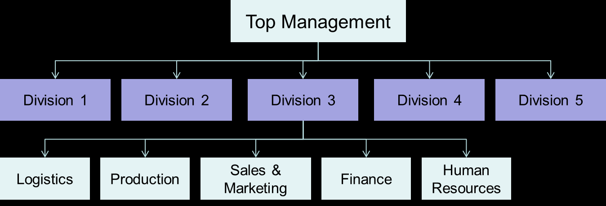
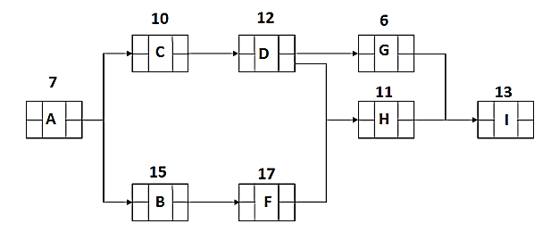

> 题源：`content/Ref/Sample Exam Questions.pdf` 的 `SAMPLE SET 1`。
>
> 参考答案与解析由 GPT-5.5 辅助生成，并结合本站课程笔记与计算复核整理；**非官方答案，仅供参考**。若与课堂讲解或官方答案冲突，以官方答案为准。标注“需人工复核”的题目表示存在题干、计算口径或官方预期答案的不确定性。

## Section A: Multiple Choice Questions

<div class="question-card quiz-card" data-answer="D">

<p class="question-title"><strong>(1.1)</strong> Which item below is correct regarding Design for Manufacturing (DFM): <strong>[2]</strong></p>

<div class="quiz-options">
<button class="quiz-option" data-option="A" type="button"><span class="quiz-option-letter">A</span><span>As a general rule, DFM can't be started at the initial stages of product design before fabrication.</span></button>
<button class="quiz-option" data-option="B" type="button"><span class="quiz-option-letter">B</span><span>DFM has advantages, including lower production costs and higher product quality; however, it may increase the time required to bring the product to market.</span></button>
<button class="quiz-option" data-option="C" type="button"><span class="quiz-option-letter">C</span><span>The DFM may impose higher manufacturing costs, but instead, it can benefit from higher customer satisfaction because of improved product quality.</span></button>
<button class="quiz-option" data-option="D" type="button"><span class="quiz-option-letter">D</span><span>DFM is a design method to reduce the complexity of manufacturing operations and the overall cost of production including the cost of raw materials.</span></button>
<button class="quiz-option" data-option="E" type="button"><span class="quiz-option-letter">E</span><span>While manufacturers were facing strong competition from other manufacturers, they were under pressure to increase production efficiency while increasing costs of production.</span></button>
</div>

<div class="quiz-explanation">
<p><strong class="quiz-answer">参考答案：D</strong></p>
<p>DFM 的核心目标是让产品更容易制造和装配，从而降低制造复杂度、材料浪费和整体成本。</p>
</div>

</div>

---

<div class="question-card quiz-card" data-answer="D">

<p class="question-title"><strong>(1.2)</strong> There is a variety of actionable sustainable design principles that can be implemented to create better designs. Some of them are below except: <strong>[2]</strong></p>

<div class="quiz-options">
<button class="quiz-option" data-option="A" type="button"><span class="quiz-option-letter">A</span><span>Dematerialization.</span></button>
<button class="quiz-option" data-option="B" type="button"><span class="quiz-option-letter">B</span><span>Migration to product-service systems.</span></button>
<button class="quiz-option" data-option="C" type="button"><span class="quiz-option-letter">C</span><span>Limit or eliminate long-distance outsourcing.</span></button>
<button class="quiz-option" data-option="D" type="button"><span class="quiz-option-letter">D</span><span>Design for a shorter period of usage.</span></button>
<button class="quiz-option" data-option="E" type="button"><span class="quiz-option-letter">E</span><span>Invest in simulation.</span></button>
</div>

<div class="quiz-explanation">
<p><strong class="quiz-answer">参考答案：D</strong></p>
<p>可持续设计通常鼓励延长产品寿命、减少材料和运输负担；“设计更短使用周期”与该方向相反。</p>
</div>

</div>

---

<div class="question-card quiz-card" data-answer="A">

<p class="question-title"><strong>(1.3)</strong> Which of the following 7QC tools can best be used to logically organize possible factors related to a specific problem by graphically displaying them in increasing detail and suggesting causal relationships among theories? <strong>[2]</strong></p>

<div class="quiz-options">
<button class="quiz-option" data-option="A" type="button"><span class="quiz-option-letter">A</span><span>Cause-Effect Diagram.</span></button>
<button class="quiz-option" data-option="B" type="button"><span class="quiz-option-letter">B</span><span>Check Sheet.</span></button>
<button class="quiz-option" data-option="C" type="button"><span class="quiz-option-letter">C</span><span>Pareto Chart.</span></button>
<button class="quiz-option" data-option="D" type="button"><span class="quiz-option-letter">D</span><span>Control Charts.</span></button>
<button class="quiz-option" data-option="E" type="button"><span class="quiz-option-letter">E</span><span>Scatter Diagram.</span></button>
</div>

<div class="quiz-explanation">
<p><strong class="quiz-answer">参考答案：A</strong></p>
<p>Cause-Effect Diagram 也叫 Fishbone/Ishikawa Diagram，用来按层次整理潜在原因并展示因果关系。</p>
</div>

</div>

---

<div class="question-card quiz-card" data-answer="A">

<p class="question-title"><strong>(1.4)</strong> Which model below is best used as a roadmap for Six Sigma to improve the quality of results produced by company processes? <strong>[2]</strong></p>

<div class="quiz-options">
<button class="quiz-option" data-option="A" type="button"><span class="quiz-option-letter">A</span><span>Define, Measure, Analyze, Improve and Control (DMAIC)</span></button>
<button class="quiz-option" data-option="B" type="button"><span class="quiz-option-letter">B</span><span>Plan, Do, Check, Act (PDCA)</span></button>
<button class="quiz-option" data-option="C" type="button"><span class="quiz-option-letter">C</span><span>Total Quality Management (TQM)</span></button>
<button class="quiz-option" data-option="D" type="button"><span class="quiz-option-letter">D</span><span>Lean Manufacturing</span></button>
<button class="quiz-option" data-option="E" type="button"><span class="quiz-option-letter">E</span><span>Failure Modes and Effects Analysis (FMEA)</span></button>
</div>

<div class="quiz-explanation">
<p><strong class="quiz-answer">参考答案：A</strong></p>
<p>Six Sigma 常用 DMAIC 作为改进现有流程的路线图。</p>
</div>

</div>

---

<div class="question-card quiz-card" data-answer="A">

<p class="question-title"><strong>(1.5)</strong> Project A has an NPV of USD 1.2 million; Project B has a BCR of 1.035; Project C has an IRR of -0.03 percent. Based on the information given, which project appears to be most attractive? <strong>[2]</strong></p>

<div class="quiz-options">
<button class="quiz-option" data-option="A" type="button"><span class="quiz-option-letter">A</span><span>Project A is the most attractive.</span></button>
<button class="quiz-option" data-option="B" type="button"><span class="quiz-option-letter">B</span><span>Project B is the most attractive.</span></button>
<button class="quiz-option" data-option="C" type="button"><span class="quiz-option-letter">C</span><span>Project C is the most attractive.</span></button>
<button class="quiz-option" data-option="D" type="button"><span class="quiz-option-letter">D</span><span>All three projects A, B, and C are equally attractive to execute.</span></button>
<button class="quiz-option" data-option="E" type="button"><span class="quiz-option-letter">E</span><span>It is uncertain which project is the most attractive to execute based on the provided information.</span></button>
</div>

<div class="quiz-explanation">
<p><strong class="quiz-answer">参考答案：A（需人工复核）</strong></p>
<p>NPV 为正且数额较大，BCR = 1.035 仅表示收益略高于成本，IRR 为负通常不可取。因此按题面“appears”判断 A 最有吸引力。严格财务比较中，不同指标和项目规模不可直接比较，若官方强调可比性，也可能接受 E。</p>
</div>

</div>

---

<div class="question-card quiz-card" data-answer="D">

<p class="question-title"><strong>(1.6)</strong> You are a project manager for an electrical manufacturing company involved in developing innovative components for renewable energy solutions. You have noticed that one of your team members is lacking knowledge in electronic component design. The same was communicated to him, and you tried sending him for training. However, the team member started arguing that he is an expert in electronic component design. Which of the following best describes this situation? <strong>[2]</strong></p>

<div class="quiz-options">
<button class="quiz-option" data-option="A" type="button"><span class="quiz-option-letter">A</span><span>The team member is consciously competent.</span></button>
<button class="quiz-option" data-option="B" type="button"><span class="quiz-option-letter">B</span><span>The team member is unconsciously competent.</span></button>
<button class="quiz-option" data-option="C" type="button"><span class="quiz-option-letter">C</span><span>The team member is consciously incompetent.</span></button>
<button class="quiz-option" data-option="D" type="button"><span class="quiz-option-letter">D</span><span>The team member is unconsciously incompetent.</span></button>
<button class="quiz-option" data-option="E" type="button"><span class="quiz-option-letter">E</span><span>The team member is aware of his/her skill, so there is no necessity for training.</span></button>
</div>

<div class="quiz-explanation">
<p><strong class="quiz-answer">参考答案：D</strong></p>
<p>该成员实际能力不足，但没有意识到自己的能力缺口，因此属于 unconsciously incompetent。</p>
</div>

</div>

---

<div class="question-card quiz-card" data-answer="D">

<p class="question-title"><strong>(1.7)</strong> In a Profit and Loss (Income) statement, Earnings before Interest, Tax, Depreciation, and Amortization (EBITDA) is equal to: <strong>[2]</strong></p>

<div class="quiz-options">
<button class="quiz-option" data-option="A" type="button"><span class="quiz-option-letter">A</span><span>Total Sales minus Cost of Sales</span></button>
<button class="quiz-option" data-option="B" type="button"><span class="quiz-option-letter">B</span><span>Total Expenses minus Net Profit</span></button>
<button class="quiz-option" data-option="C" type="button"><span class="quiz-option-letter">C</span><span>Total Sales minus (Salaries + Rent)</span></button>
<button class="quiz-option" data-option="D" type="button"><span class="quiz-option-letter">D</span><span>Gross Profit minus all company operating expenses (salaries and rent etc.)</span></button>
<button class="quiz-option" data-option="E" type="button"><span class="quiz-option-letter">E</span><span>Full production costs minus Net Profit</span></button>
</div>

<div class="quiz-explanation">
<p><strong class="quiz-answer">参考答案：D</strong></p>
<p>在题目给出的简化口径下，EBITDA 可理解为 Gross Profit 扣除工资、租金等经营费用后、尚未扣除利息、税、折旧和摊销的收益。</p>
</div>

</div>

---

<div class="question-card quiz-card" data-answer="B">

<p class="question-title"><strong>(1.8)</strong> You are an engineer working on a project that depends on a new type of battery technology for success. During the development of the product, a report appears in a respected science publication that there may be health issues associated with the new battery technology if it leaks but they do not yet have reliable data. You are under pressure from your boss to complete your project, what do you do? <strong>[2]</strong></p>

<div class="quiz-options">
<button class="quiz-option" data-option="A" type="button"><span class="quiz-option-letter">A</span><span>Tell your boss there is no reliable data so you should complete the project against the original plan.</span></button>
<button class="quiz-option" data-option="B" type="button"><span class="quiz-option-letter">B</span><span>Advise your boss that although there is no reliable data, you should adopt a precautionary approach and install further protection around the battery along with a monitoring system to detect leaks.</span></button>
<button class="quiz-option" data-option="C" type="button"><span class="quiz-option-letter">C</span><span>Stop work on the project and advise your boss that if he does not cancel the project you will report him to the health authorities.</span></button>
<button class="quiz-option" data-option="D" type="button"><span class="quiz-option-letter">D</span><span>Advise your boss if you cannot use the battery technology then they should cancel the project and the product that uses it.</span></button>
<button class="quiz-option" data-option="E" type="button"><span class="quiz-option-letter">E</span><span>Approach the author of the science publication and offer to pay for a holiday if the author writes another article stating that the first article was wrong.</span></button>
</div>

<div class="quiz-explanation">
<p><strong class="quiz-answer">参考答案：B</strong></p>
<p>工程伦理中应采用预防原则，不能因为数据尚不充分就忽视潜在健康风险。</p>
</div>

</div>

---

<div class="question-card quiz-card" data-answer="C">

<p class="question-title"><strong>(1.9)</strong> If a company has an organizational structure shown below, it is called: <strong>[2]</strong></p>

<p></p>

<div class="quiz-options">
<button class="quiz-option" data-option="A" type="button"><span class="quiz-option-letter">A</span><span>A Team-Based Structure</span></button>
<button class="quiz-option" data-option="B" type="button"><span class="quiz-option-letter">B</span><span>A Matrix Structure</span></button>
<button class="quiz-option" data-option="C" type="button"><span class="quiz-option-letter">C</span><span>A Divisional Structure</span></button>
<button class="quiz-option" data-option="D" type="button"><span class="quiz-option-letter">D</span><span>A Simple Startup Structure</span></button>
<button class="quiz-option" data-option="E" type="button"><span class="quiz-option-letter">E</span><span>A Military Command Structure</span></button>
</div>

<div class="quiz-explanation">
<p><strong class="quiz-answer">参考答案：C</strong></p>
<p>图中 Top Management 下按 Division 1-5 分成事业部，并在事业部下配置职能部门，是典型 divisional structure。</p>
</div>

</div>

---

<div class="question-card quiz-card" data-answer="B">

<p class="question-title"><strong>(1.10)</strong> You have fifteen members in your engineering project team. You have called for a project status meeting without prior notice. During the meeting, there were too many side conversations and arguments. As a result, the team achieved very little in the meeting. To achieve orderliness in the meeting next time, you should: <strong>[2]</strong></p>

<div class="quiz-options">
<button class="quiz-option" data-option="A" type="button"><span class="quiz-option-letter">A</span><span>Decrease the number of people in the meeting</span></button>
<button class="quiz-option" data-option="B" type="button"><span class="quiz-option-letter">B</span><span>Publish a meeting agenda</span></button>
<button class="quiz-option" data-option="C" type="button"><span class="quiz-option-letter">C</span><span>Ensure that you control the channels of communication</span></button>
<button class="quiz-option" data-option="D" type="button"><span class="quiz-option-letter">D</span><span>Give incentives to team members for conforming to desired meeting norms</span></button>
<button class="quiz-option" data-option="E" type="button"><span class="quiz-option-letter">E</span><span>Invite a member from the higher management/executive team</span></button>
</div>

<div class="quiz-explanation">
<p><strong class="quiz-answer">参考答案：B</strong></p>
<p>会议无预先通知且无秩序，下一次应先发布议程，明确会议目标、主题和时间安排。</p>
</div>

</div>

---

<div class="question-card quiz-card" data-answer="A">

<p class="question-title"><strong>(1.11)</strong> A part of the cash flow with 30-days net payment terms for cash-in and cash-out is given in Table Q1 (1.11) below. Determine the cumulative cash towards the end of each month (M). The currency utilized for transactions in this cash flow is RMB. <strong>[2]</strong></p>

<table>
<thead><tr><th></th><th>M0</th><th>M1</th><th>M2</th><th>M3</th><th>M4</th><th>M5</th></tr></thead>
<tbody>
<tr><td>Sales Bookings</td><td>10</td><td>12</td><td>8</td><td>20</td><td>100</td><td>0</td></tr>
<tr><td>Shipments</td><td>0</td><td>10</td><td>12</td><td>8</td><td>20</td><td>100</td></tr>
<tr><td>Components Order</td><td>5</td><td>6</td><td>4</td><td>10</td><td>50</td><td>0</td></tr>
</tbody>
</table>

<div class="quiz-options">
<button class="quiz-option" data-option="A" type="button"><span class="quiz-option-letter">A</span><span>M0 = 0; M1 = -5; M2 = -1; M3 = +7; M4 = +5; M5 = -25</span></button>
<button class="quiz-option" data-option="B" type="button"><span class="quiz-option-letter">B</span><span>M0 = -5; M1 = -6; M2 = -4; M3 = -10; M4 = -50; M5 = 0</span></button>
<button class="quiz-option" data-option="C" type="button"><span class="quiz-option-letter">C</span><span>M0 = 0; M1 = -10; M2 = -12; M3 = -8; M4 = -20; M5 = -100</span></button>
<button class="quiz-option" data-option="D" type="button"><span class="quiz-option-letter">D</span><span>M0 = -5; M1 = -16; M2 = -16; M3 = -18; M4 = -70; M5 = -100</span></button>
<button class="quiz-option" data-option="E" type="button"><span class="quiz-option-letter">E</span><span>M0 = 0; M1 = -5; M2 = +4; M3 = +8; M4 = -2; M5 = -30</span></button>
</div>

<div class="quiz-explanation">
<p><strong class="quiz-answer">参考答案：A</strong></p>
<p>30 天账期下，当月现金流入来自上月 shipments，当月现金流出来自上月 components order。月度净现金流为 0, -5, +4, +8, -2, -30，因此累计为 0, -5, -1, +7, +5, -25。</p>
</div>

</div>

---

<div class="question-card quiz-card" data-answer="C">

<p class="question-title"><strong>(1.12)</strong> Based on Q1 (1.11) above, how do you classify the trading nature for such a type of cash-flow statements? <strong>[2]</strong></p>

<div class="quiz-options">
<button class="quiz-option" data-option="A" type="button"><span class="quiz-option-letter">A</span><span>Well-balanced trading</span></button>
<button class="quiz-option" data-option="B" type="button"><span class="quiz-option-letter">B</span><span>Under trading</span></button>
<button class="quiz-option" data-option="C" type="button"><span class="quiz-option-letter">C</span><span>Over trading</span></button>
<button class="quiz-option" data-option="D" type="button"><span class="quiz-option-letter">D</span><span>No trading</span></button>
<button class="quiz-option" data-option="E" type="button"><span class="quiz-option-letter">E</span><span>Well-established trading</span></button>
</div>

<div class="quiz-explanation">
<p><strong class="quiz-answer">参考答案：C</strong></p>
<p>订单和出货增长较快，但采购支出先发生、回款滞后，导致累计现金在 M5 大幅转负。这是典型 over trading：销售扩张超过现金流承受能力。</p>
</div>

</div>

## Section B: Long Questions

### Q2 [25 marks]

#### Q2(a) DFM 与可持续设计

A company is designing a new household appliance and is considering two possible designs for one of its components.

- Design A consists of five separate parts that need to be assembled.
- Design B integrates these parts into a single molded component.

(i) Discuss the advantages and disadvantages of each design from a Design for Manufacturing (DFM) perspective. **[6]**

(ii) Design A consists of five separate parts that need to be assembled, and one of these parts can be reused in other devices. Design B integrates all parts into a single molded component, making it smaller in size. In terms of actionable sustainable design principles, compare the two designs. **[4]**

(iii) The 4Rs, in particular, are a very effective tool in building a circular economy. They include four principles that can be applied by almost every individual and have an exponential effect. Distinguish the principles of the 4Rs that Design A and Design B primarily apply to promote the circular economy. **[3]**

<details>
<summary>展示参考答案</summary>

**(i) DFM 比较**

| 设计 | 优点 | 缺点 |
| --- | --- | --- |
| Design A: 5 个独立零件 | 零件可单独替换；某些零件可复用；维修和升级更方便；模具或单件制造风险较低 | 零件数量多；装配步骤多；装配时间和人工成本高；误装、漏装和公差叠加风险更高；库存和供应链更复杂 |
| Design B: 单个模制件 | 零件数减少；装配步骤减少；制造和装配更快；尺寸更小；质量一致性更好；总体 DFM 更优 | 初始模具成本可能较高；设计修改更困难；某一局部损坏可能导致整个部件报废；复用和维修性较差 |

从 DFM 角度，若产品批量较大且设计稳定，Design B 通常更符合简化零件、减少装配和降低制造成本的原则。

**(ii) 可持续设计比较**

Design A 的优势是其中一个零件可在其他设备中复用，支持 reuse、维修、升级和延长零件生命周期；但它零件多、装配复杂，可能带来更多材料、运输、库存和装配资源消耗。

Design B 的优势是集成为更小的单一部件，支持 dematerialization，减少零件数量、装配能耗和潜在浪费；但它的可维修性和可复用性较弱，若局部损坏，可能需要替换整个组件。

**(iii) 4Rs 对应**

Design A 主要对应 **Reuse**，因为其中一个零件可以在其他设备中重复使用；也部分支持 **Repair**，因为独立零件更容易拆卸和更换。

Design B 主要对应 **Reduce**，因为单一模制件减少零件数量、材料使用和装配步骤。若材料选择支持回收，也可进一步支持 **Recycle**，但题干中最明确的是 Reduce。

</details>

#### Q2(b) Control Chart

The night shift operator recorded twenty current (mA) samples during electronic circuit testing. Evaluate whether the process is under control by utilizing a control chart, considering `2 * Sigma`. **[7]**

| #Sample | Current (mA) | #Sample | Current (mA) |
| --- | ---: | --- | ---: |
| 1 | 510 | 11 | 505 |
| 2 | 516 | 12 | 511 |
| 3 | 500 | 13 | 500 |
| 4 | 495 | 14 | 498 |
| 5 | 505 | 15 | 501 |
| 6 | 500 | 16 | 500 |
| 7 | 510 | 17 | 490 |
| 8 | 505 | 18 | 505 |
| 9 | 500 | 19 | 507 |
| 10 | 499 | 20 | 500 |

<details>
<summary>展示参考答案</summary>

样本均值：

$$
\bar{x} = \frac{10057}{20} = 502.85\ \text{mA}
$$

用样本标准差估计：

$$
s \approx 6.046\ \text{mA}
$$

因为题目要求 `2 * Sigma`，控制界限为：

$$
\mathrm{UCL} = \bar{x} + 2s = 502.85 + 12.092 \approx 514.94\ \text{mA}
$$

$$
\mathrm{LCL} = \bar{x} - 2s = 502.85 - 12.092 \approx 490.76\ \text{mA}
$$

| 指标 | 数值 |
| --- | ---: |
| Central Line | 502.85 mA |
| UCL | 514.94 mA |
| LCL | 490.76 mA |

样本 2 的电流为 516 mA，高于 UCL；样本 17 的电流为 490 mA，低于 LCL。因此该过程存在超出控制界限的点，不能认为过程处于统计受控状态。

若使用总体标准差，UCL/LCL 约为 514.64/491.06 mA，结论仍相同。

</details>

#### Q2(c) Process Capability

Assume that the manufacturer's target for the process in (b) is 500 mA, with a tolerance of `±5 mA`. Evaluate both process capability indices for this manufacturing operation. Discuss your findings. **[5]**

<details>
<summary>展示参考答案</summary>

规格界限：

$$
\mathrm{USL}=505,\quad \mathrm{LSL}=495
$$

使用 Q2(b) 的样本标准差 `s = 6.046`，过程能力指数为：

$$
C_p = \frac{\mathrm{USL} - \mathrm{LSL}}{6s} = \frac{10}{6\times 6.046} \approx 0.276
$$

过程均值为 `502.85 mA`，偏向上规格限，因此：

$$
C_{pk}=\min\left(\frac{505-502.85}{3s},\frac{502.85-495}{3s}\right)
$$

$$
C_{pk}=\min(0.119, 0.433) = 0.119
$$

结论：`Cp < 1` 表明过程自然波动范围大于规格范围，过程能力不足；`Cpk` 更低，说明过程均值还偏向 USL。该制造过程不能稳定满足 `500 ± 5 mA` 的规格，需要降低变异并把均值拉回目标值 500 mA。

</details>

### Q3 [25 marks]

#### Q3(a) Project Management 与 Quality

(i) John is overseeing the development of a new electronic device prototype. The most likely project duration is 10 months. In the best-case scenario, efficient collaboration with a specialized component supplier could reduce the duration by 2 months. However, a delay in obtaining critical components might extend the project by 3 months. Using the three-point estimating technique, calculate the expected project duration using both Triangular Distribution and Beta Distribution. Also, determine the standard deviation for each approach. **[3]**

<details>
<summary>展示参考答案</summary>

三点估算参数：

$$
O=8,\quad M=10,\quad P=13
$$

Triangular Distribution 的期望值：

$$
E_T=\frac{O+M+P}{3}=\frac{8+10+13}{3}=10.33\ \text{months}
$$

Triangular Distribution 的标准差：

$$
\sigma_T=\sqrt{\frac{O^2+M^2+P^2-OM-OP-MP}{18}}=\sqrt{\frac{19}{18}}\approx 1.03\ \text{months}
$$

Beta/PERT Distribution 的期望值：

$$
E_B=\frac{O+4M+P}{6}=\frac{8+40+13}{6}=10.17\ \text{months}
$$

Beta/PERT Distribution 的标准差：

$$
\sigma_B=\frac{P-O}{6}=\frac{13-8}{6}=0.83\ \text{months}
$$

</details>

(ii) You are leading a project team consisting of 11 members. As the project transitions into the next phase, three new members join the team while two existing members depart. Based on these changes, determine the number of additional communication channels that will be created. **[2]**

<details>
<summary>展示参考答案</summary>

沟通渠道数量公式：

$$
\frac{n(n-1)}{2}
$$

原团队 `n = 11`：

$$
\frac{11\times10}{2}=55
$$

新团队人数为 `11 + 3 - 2 = 12`：

$$
\frac{12\times11}{2}=66
$$

新增沟通渠道：

$$
66-55=11
$$

因此新增 **11** 条沟通渠道。

</details>

(iii) Assume an electronic product engineer has collected 10 observations for a specific product's quality characteristic, which is nominally the best at a target value of 8.5. The engineer uses the Taguchi loss function where `k = 1`. Given Table Q3(a), compute the Taguchi loss function for each observation and determine the total loss. **[3]**

| Observation | Measurement | Observation | Measurement |
| --- | ---: | --- | ---: |
| 1 | 8.10 | 6 | 8.35 |
| 2 | 8.90 | 7 | 8.25 |
| 3 | 8.45 | 8 | 8.68 |
| 4 | 9.25 | 9 | 8.90 |
| 5 | 8.86 | 10 | 9.05 |

<details>
<summary>展示参考答案</summary>

Nominal-the-best Taguchi loss：

$$
L(y)=k(y-m)^2=(y-8.5)^2
$$

| Observation | y | Loss |
| --- | ---: | ---: |
| 1 | 8.10 | 0.1600 |
| 2 | 8.90 | 0.1600 |
| 3 | 8.45 | 0.0025 |
| 4 | 9.25 | 0.5625 |
| 5 | 8.86 | 0.1296 |
| 6 | 8.35 | 0.0225 |
| 7 | 8.25 | 0.0625 |
| 8 | 8.68 | 0.0324 |
| 9 | 8.90 | 0.1600 |
| 10 | 9.05 | 0.3025 |

总损失：

$$
\sum L(y)=1.5945
$$

平均损失为 `0.15945`。题目要求 total loss 时，应填写 **1.5945**。

</details>

(iv) You have been assigned as the project manager for the development of a basic embedded system for controlling a temperature sensor in a smart home application. The major phases of the project are planning, design, and testing. The WBS is decomposed down through these phases, where each phase is broken down into two additional activities at Level 2. Based on this, plot the WBS for the project, showing all three levels clearly. **[4]**

<details>
<summary>展示参考答案</summary>

参考 WBS：

```text
Level 1: Smart Home Temperature Sensor Embedded System
├─ Level 2: Planning
│  ├─ Level 3: Define requirements and scope
│  └─ Level 3: Prepare schedule, budget, and risk plan
├─ Level 2: Design
│  ├─ Level 3: Hardware interface and sensor circuit design
│  └─ Level 3: Firmware architecture and control logic design
└─ Level 2: Testing
   ├─ Level 3: Unit and integration testing
   └─ Level 3: System validation and acceptance testing
```

评分重点是三层结构清楚：项目作为 Level 1，Planning/Design/Testing 作为 Level 2，每个阶段再拆成两个 Level 3 工作包。

</details>

#### Q3(b) CPM

Project schedule management includes the processes required to manage the timely completion of the project. Consider a project with the network diagram shown in Figure Q3(b) and answer the following questions.

<p></p>

(i) Perform the forward pass analysis through the schedule network and compute Early Start and Early Finish dates for all activities. **[5]**

(ii) Perform the backward pass analysis through the schedule network and compute Late Start and Late Finish dates for all activities. **[5]**

(iii) Calculate the total float (slack) for all activities. **[2]**

(iv) Define the Critical Path. **[1]**

<details>
<summary>展示参考答案</summary>

活动工期和依赖关系按图读取如下：

| Activity | Duration | Predecessors |
| --- | ---: | --- |
| A | 7 | - |
| B | 15 | A |
| C | 10 | A |
| D | 12 | C |
| F | 17 | B |
| G | 6 | D |
| H | 11 | D, F |
| I | 13 | G, H |

Forward pass：

| Activity | ES | EF |
| --- | ---: | ---: |
| A | 0 | 7 |
| B | 7 | 22 |
| C | 7 | 17 |
| D | 17 | 29 |
| F | 22 | 39 |
| G | 29 | 35 |
| H | 39 | 50 |
| I | 50 | 63 |

Backward pass：

| Activity | LS | LF |
| --- | ---: | ---: |
| A | 0 | 7 |
| B | 7 | 22 |
| C | 17 | 27 |
| D | 27 | 39 |
| F | 22 | 39 |
| G | 44 | 50 |
| H | 39 | 50 |
| I | 50 | 63 |

Total float：

| Activity | Total Float |
| --- | ---: |
| A | 0 |
| B | 0 |
| C | 10 |
| D | 10 |
| F | 0 |
| G | 15 |
| H | 0 |
| I | 0 |

Critical Path：

$$
A \rightarrow B \rightarrow F \rightarrow H \rightarrow I
$$

项目总工期为 **63**。

</details>

### Q4 [26 marks]

VRtuoso is a company that produces virtual reality (VR) headsets. Each headset comprises two specialized lenses. The company manufactures `0.6 Million (M)` headsets annually. The lenses are provided by an external supplier for `675 RMB` each. The company also has vacant production facilities with a fixed overhead cost of `39 M RMB`. Currently, the vacant production facilities are rented out for `2 M RMB` per year, but the renter may not renew the agreement.

#### Q4(a) Purchasing Cost Scenarios

Draw a table comparing the equivalent cost of purchasing a lens from the external supplier while the vacant production facilities are rented out vs. the scenario if the rental agreement is not renewed. **[5]**

<details>
<summary>展示参考答案</summary>

Annual headset quantity = `0.6 M`.

Each headset uses 2 lenses, so annual lens quantity:

$$
0.6M \times 2 = 1.2M\ \text{lenses}
$$

External purchase cost:

$$
1.2M \times 675 = 810M\ \text{RMB}
$$

| Scenario | Lens purchase cost | Fixed overhead | Rental income | Annual equivalent cost |
| --- | ---: | ---: | ---: | ---: |
| Facilities rented out | 810 M | 39 M | -2 M | 847 M RMB |
| Rental not renewed | 810 M | 39 M | 0 | 849 M RMB |

Equivalent cost per lens:

| Scenario | Cost per lens |
| --- | ---: |
| Facilities rented out | 847M / 1.2M = 705.83 RMB |
| Rental not renewed | 849M / 1.2M = 707.50 RMB |

</details>

#### Q4(b) Make-or-Buy Decision

VRtuoso plans to use the vacant production facilities for manufacturing the lenses. In addition to the fixed overhead cost, the production cost breakdown for a lens consists of direct materials cost `325.00 RMB`, direct labor cost `215.00 RMB`, and variable overhead cost `127.50 RMB`. Prepare a new cost table and decide whether VRtuoso should continue purchasing the lenses or start manufacturing their own lenses. **[5]**

<details>
<summary>展示参考答案</summary>

Variable manufacturing cost per lens:

$$
325 + 215 + 127.5 = 667.5\ \text{RMB/lens}
$$

Annual internal manufacturing cost:

$$
1.2M \times 667.5 + 39M = 801M + 39M = 840M\ \text{RMB}
$$

| Option | Variable / purchase cost | Fixed overhead | Rental income | Total annual cost |
| --- | ---: | ---: | ---: | ---: |
| Buy, rental not renewed | 810 M | 39 M | 0 | 849 M RMB |
| Make internally | 801 M | 39 M | 0 | 840 M RMB |

Internal manufacturing saves:

$$
849M - 840M = 9M\ \text{RMB per year}
$$

Therefore, if the rental agreement is not renewed, VRtuoso should manufacture the lenses internally. Even compared with the rented-out purchasing scenario in Q4(a), internal manufacturing is still cheaper by `847M - 840M = 7M RMB`.

</details>

#### Q4(c) Cost and Revenue Table

If VRtuoso can sell the VR headsets for `1,413 RMB` each, draw a table demonstrating production costs and sales revenue from `0 -> 1 M` headsets with an increment size of `0.2 M`. **[6]**

<details>
<summary>展示参考答案</summary>

Variable manufacturing cost per headset:

$$
2 \times 667.5 = 1335\ \text{RMB/headset}
$$

Total cost and revenue formulas:

$$
TC = 39M + 1335Q
$$

$$
REV = 1413Q
$$

where `Q` is the number of headsets.

| Q (M headsets) | Total Cost (M RMB) | Revenue (M RMB) | Profit (M RMB) |
| ---: | ---: | ---: | ---: |
| 0.0 | 39.0 | 0.0 | -39.0 |
| 0.2 | 306.0 | 282.6 | -23.4 |
| 0.4 | 573.0 | 565.2 | -7.8 |
| 0.6 | 840.0 | 847.8 | 7.8 |
| 0.8 | 1107.0 | 1130.4 | 23.4 |
| 1.0 | 1374.0 | 1413.0 | 39.0 |

</details>

#### Q4(d) Profit and Safety Margin

If the VRtuoso factory is running at full capacity of `0.6 M` headsets per year with an assumed price of `1,413 RMB` per headset, what is the profit made by VRtuoso? What is the safety margin? **[5]**

<details>
<summary>展示参考答案</summary>

At `Q = 0.6M` headsets:

$$
REV = 0.6M \times 1413 = 847.8M\ \text{RMB}
$$

$$
TC = 39M + 0.6M \times 1335 = 840M\ \text{RMB}
$$

Profit:

$$
847.8M - 840M = 7.8M\ \text{RMB}
$$

Break-even quantity:

$$
Q_{BE}=\frac{FC}{SP-VC}=\frac{39M}{1413-1335}=500,000\ \text{headsets}
$$

Safety margin in units:

$$
600,000 - 500,000 = 100,000\ \text{headsets}
$$

Safety margin percentage:

$$
\frac{100,000}{600,000}=16.7\%
$$

Safety margin in revenue:

$$
100,000 \times 1413 = 141.3M\ \text{RMB}
$$

</details>

#### Q4(e) Break-even Graph

Draw a Break-even graph showing Total Cost (TC), Variable Cost (VC), and Revenue (REV) against production quantity (Q). Calculate the Break-even Point and indicate this on the graph. **[5]**

<details>
<summary>展示参考答案</summary>

Graph lines to draw:

$$
FC = 39M
$$

$$
VC = 1335Q
$$

$$
TC = 39M + 1335Q
$$

$$
REV = 1413Q
$$

Break-even occurs where `REV = TC`:

$$
1413Q = 39M + 1335Q
$$

$$
78Q = 39M
$$

$$
Q = 500,000\ \text{headsets}
$$

At the break-even point:

$$
REV = 1413 \times 500,000 = 706.5M\ \text{RMB}
$$

$$
TC = 39M + 1335 \times 500,000 = 706.5M\ \text{RMB}
$$

When drawing the graph, use quantity `Q` on the x-axis and RMB on the y-axis. The Revenue line starts from zero with slope 1413; the TC line starts at 39M with slope 1335; the VC line starts from zero with slope 1335. Mark the intersection between REV and TC at **500,000 headsets, 706.5M RMB**.

</details>
