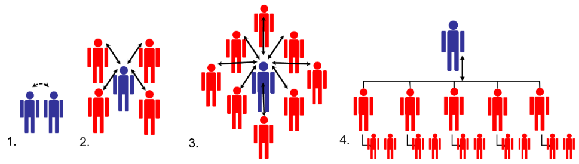

> 题源：`content/Ref/Sample Exam Questions.pdf` 的 `SAMPLE SET 2`。
>
> 参考答案与解析由 GPT-5.5 辅助生成，并结合本站课程笔记与计算复核整理；**非官方答案，仅供参考**。若与课堂讲解或官方答案冲突，以官方答案为准。标注“需人工复核”的题目表示存在题干、计算口径或官方预期答案的不确定性。

## Section A: Multiple Choice Questions

<strong>(1.1)</strong> Which of the following best aligns with the principles of Design for Manufacturing (DFM)? <strong>[2]</strong>

<button class="quiz-option" data-option="A" type="button">AIncreasing the number of parts in a design to improve flexibility in manufacturing.</button>
<button class="quiz-option" data-option="B" type="button">BUsing complex shapes and intricate structures to enhance product uniqueness.</button>
<button class="quiz-option" data-option="C" type="button">CMinimizing the number of parts and using straightforward shapes to ease production and reduce costs.</button>
<button class="quiz-option" data-option="D" type="button">DPrioritizing visual design over how easy it is to make.</button>
<button class="quiz-option" data-option="E" type="button">EAdding redundant features to ensure product robustness.</button>

<strong class="quiz-answer">参考答案：C</strong>

DFM 强调简化零件、降低装配复杂度、减少制造成本。减少零件数并使用简单形状最符合该原则。

---

<strong>(1.2)</strong> Which statement accurately describes a cause-effect diagram? <strong>[2]</strong>

<button class="quiz-option" data-option="A" type="button">AIt is primarily used to illustrate the effects of a specific problem without identifying its root causes.</button>
<button class="quiz-option" data-option="B" type="button">BIt is a visual tool used to focus on the sole cause of a given problem.</button>
<button class="quiz-option" data-option="C" type="button">CIt indicates relationships between various effects with no need for visual tools.</button>
<button class="quiz-option" data-option="D" type="button">DIt is a visual tool used to logically organize possible causes for a specific problem or effect by graphically displaying them in increasing detail.</button>
<button class="quiz-option" data-option="E" type="button">EIt is exclusively used to identify effects, without organizing possible causes.</button>

<strong class="quiz-answer">参考答案：D</strong>

Cause-effect diagram，也称鱼骨图或 Ishikawa diagram，用来系统整理某个问题的潜在原因。

---

<strong>(1.3)</strong> Which of the following 7QC tools can best be used to study how a process changes over time? <strong>[2]</strong>

<button class="quiz-option" data-option="A" type="button">ACause-Effect Diagram.</button>
<button class="quiz-option" data-option="B" type="button">BCheck Sheet.</button>
<button class="quiz-option" data-option="C" type="button">CPareto Chart.</button>
<button class="quiz-option" data-option="D" type="button">DControl Charts.</button>
<button class="quiz-option" data-option="E" type="button">EScatter Diagram.</button>

<strong class="quiz-answer">参考答案：D</strong>

Control chart 用时间序列方式观察过程是否稳定、是否存在异常波动。

---

<strong>(1.4)</strong> Which of the following is not considered a project? <strong>[2]</strong>

<button class="quiz-option" data-option="A" type="button">ACreating a prototype for a next-generation smartphone.</button>
<button class="quiz-option" data-option="B" type="button">BDesigning and deploying a new software algorithm for real-time data processing in an electronic control system.</button>
<button class="quiz-option" data-option="C" type="button">CDeveloping periodic updates for an existing software system in a manufacturing plant.</button>
<button class="quiz-option" data-option="D" type="button">DSetting up a waste reduction program in an office environment.</button>
<button class="quiz-option" data-option="E" type="button">EDesigning and constructing a printed circuit board (PCB) for a new electronic device.</button>

<strong class="quiz-answer">参考答案：C</strong>

项目是临时性的、产生独特成果；周期性软件更新更像持续运营或例行维护。

---

<strong>(1.5)</strong> This technique can mainly be used in project management to identify risks, particularly in assessing external factors and internal vulnerabilities that can impact the project. <strong>[2]</strong>

<button class="quiz-option" data-option="A" type="button">AFailure Modes and Effects Analysis (FMEA)</button>
<button class="quiz-option" data-option="B" type="button">BStrengths, Weaknesses, Opportunities, and Threats (SWOT)</button>
<button class="quiz-option" data-option="C" type="button">CInternal Rate of Return (IRR)</button>
<button class="quiz-option" data-option="D" type="button">DNet Present Value (NPV)</button>
<button class="quiz-option" data-option="E" type="button">EBenefit-Cost Ratio (BCR)</button>

<strong class="quiz-answer">参考答案：B</strong>

SWOT 同时考虑内部 strengths/weaknesses 与外部 opportunities/threats，常用于风险识别。

---

<strong>(1.6)</strong> Carmen arranges a meeting with the steering committee and project sponsor to take them through the case study, answer questions, and seek official confirmation that the case study meets their expectations. What process is she performing here? <strong>[2]</strong>

<button class="quiz-option" data-option="A" type="button">ADeliverables Acceptance.</button>
<button class="quiz-option" data-option="B" type="button">BAccept Deliverables.</button>
<button class="quiz-option" data-option="C" type="button">CValidate Scope.</button>
<button class="quiz-option" data-option="D" type="button">DPlan Scope Management.</button>
<button class="quiz-option" data-option="E" type="button">EClose Project or Phase.</button>

<strong class="quiz-answer">参考答案：C</strong>

Validate Scope 是让客户或发起人正式确认交付物符合要求的过程。

---

<strong>(1.7)</strong> The following organizational structures should be labeled as: <strong>[2]</strong>

<button class="quiz-option" data-option="A" type="button">A1. Start-up; 2. Expansion; 3. Growth; 4. Formal Organisation</button>
<button class="quiz-option" data-option="B" type="button">B1. Expansion; 2. Start-up; 3. Formal Organisation; 4. Growth</button>
<button class="quiz-option" data-option="C" type="button">C1. Start-up; 2. Growth; 3. Expansion; 4. Formal Organisation</button>
<button class="quiz-option" data-option="D" type="button">D1. Expansion; 2. Start-up; 3. Growth; 4. Formal Organisation</button>
<button class="quiz-option" data-option="E" type="button">E1. Growth; 2. Start-up; 3. Formal Organisation; 4. Expansion</button>

<strong class="quiz-answer">参考答案：A</strong>

结构从直接协作的初创企业，发展为出现领导者的扩张阶段，再到更多员工的增长阶段，最后形成多层级正式组织。

---

<strong>(1.8)</strong> Which of the following statements does NOT adhere to the sustainability principle “Use resources efficiently and effectively”? <strong>[2]</strong>

<button class="quiz-option" data-option="A" type="button">AUnderstand there are environmental limits and finite resources.</button>
<button class="quiz-option" data-option="B" type="button">BUse systems and products that reduce embedded carbon, energy and water use, waste, and pollution.</button>
<button class="quiz-option" data-option="C" type="button">CEngage a waste management contractor who specializes in shipping waste to regions with lower environmental standards.</button>
<button class="quiz-option" data-option="D" type="button">DAdopt strategies for re-use, recycling, decommissioning, and disposal of components and materials.</button>
<button class="quiz-option" data-option="E" type="button">EWork to repair any damage.</button>

<strong class="quiz-answer">参考答案：C</strong>

把废弃物转移到环境标准更低的地区不是资源高效使用，而是转嫁环境责任。

---

<strong>(1.9)</strong> Consider the structure of a start-up company run by an entrepreneur. Find the correct pair of true statements. <strong>[2]</strong>

1. Maximum standardisation and formalisation 2. Few layers: Limited middle-line managerial levels 3. Decentralized and indirect supervision 4. Wide span of control around the entrepreneur

<button class="quiz-option" data-option="A" type="button">A1 and 2</button>
<button class="quiz-option" data-option="B" type="button">B3 and 4</button>
<button class="quiz-option" data-option="C" type="button">C2 and 3</button>
<button class="quiz-option" data-option="D" type="button">D2 and 4</button>
<button class="quiz-option" data-option="E" type="button">E1 and 3</button>

<strong class="quiz-answer">参考答案：D</strong>

初创结构通常层级少、形式化低，创业者直接监督且控制幅度较宽。

---

<strong>(1.10)</strong> It costs 1000 RMB for hand tools and 1.50 RMB labor per unit. An automated alternative costs 15,000 RMB with 0.50 RMB per-unit cost. With annual production of 5000 units, how long will it take to reach the production cost cross-over point? <strong>[2]</strong>

<button class="quiz-option" data-option="A" type="button">A2.0 yr</button>
<button class="quiz-option" data-option="B" type="button">BNever</button>
<button class="quiz-option" data-option="C" type="button">C3.6 yr</button>
<button class="quiz-option" data-option="D" type="button">D2.8 yr</button>
<button class="quiz-option" data-option="E" type="button">E0.9 yr</button>

<strong class="quiz-answer">参考答案：D</strong>

固定成本差为 14,000 RMB，单位节省为 1 RMB，因此交叉点为 14,000 件；按 5,000 件/年，需要 2.8 年。

---

<strong>(1.11)</strong> When developing a new product, which stage has the biggest impact on the final product's price, quality, and manufacturing time? <strong>[2]</strong>

<button class="quiz-option" data-option="A" type="button">AMostly during manufacturing</button>
<button class="quiz-option" data-option="B" type="button">BMostly during product development</button>
<button class="quiz-option" data-option="C" type="button">CEqually during product development and manufacturing</button>
<button class="quiz-option" data-option="D" type="button">DMostly during sales and marketing</button>
<button class="quiz-option" data-option="E" type="button">EAfter customer feedback during mass production</button>

<strong class="quiz-answer">参考答案：B</strong>

产品成本、质量和制造时间的大部分影响在产品开发/设计阶段已经被锁定。

---

<strong>(1.12)</strong> In the execution phase of a project, key man resources are lost, and new staff join. The project manager sets up a meeting with the new team. What should be the most important agenda item? <strong>[2]</strong>

<button class="quiz-option" data-option="A" type="button">ADiscussing team building activities</button>
<button class="quiz-option" data-option="B" type="button">BReviewing WBS and responsibilities of all team members</button>
<button class="quiz-option" data-option="C" type="button">CInviting the team members to share their past project experiences</button>
<button class="quiz-option" data-option="D" type="button">DPlanning risk responses for existing risks</button>
<button class="quiz-option" data-option="E" type="button">EAssigning someone from the new members to lead the meeting</button>

<strong class="quiz-answer">参考答案：B</strong>

关键人员变化后，最重要的是重新明确范围、工作包和责任分配。

## Section B: Long Questions

### Q2 [26 marks]

#### Q2(d) Sustainability Pillars

(i) Explain the three pillars of sustainability. **[6]**

(ii) Compare the responsibility for sustainability between manufacturing companies and end-user consumers. **[4]**

展示参考答案

**(i) 三大支柱**

| Pillar | Explanation |
| --- | --- |
| Environmental | 降低资源消耗、污染、废弃物、碳排放和生态破坏，确保自然系统可持续。 |
| Economic | 在生命周期内保持财务可行性，控制成本、创造价值，使企业和社会能够长期运转。 |
| Social | 关注人员安全、健康、公平、社区影响、劳动条件和代际公平。 |

可持续性要求三者平衡：不能只追求经济增长而牺牲环境和社会，也不能只关注环保而使方案完全不可实施。

**(ii) 制造商与消费者责任比较**

制造企业的责任更集中在设计、材料选择、生产过程、供应链、能耗、包装、可维修性、回收和生命周期影响上。企业在产品早期设计阶段有最大的杠杆，应通过 DFM、可持续设计、减少材料、降低废弃物、提高可维修性和制定回收方案来承担责任。

终端消费者的责任主要体现在购买、使用、维护和处置阶段。例如选择更耐用或节能的产品，合理使用和维护，延长产品寿命，减少过度消费，并按要求回收或处置废弃产品。

两者都承担责任，但制造商通常对产品生命周期影响有更强的前置控制能力，消费者则通过需求和使用行为影响市场与实际环境结果。

#### Q2(e) Fishbone Diagram

In a circuit board assembly line, incorrect signal outputs are increasing during signal testing. Investigate root causes using a Cause and Effect (Fishbone) Diagram with categories Machines, Materials, Methods, and Manpower. List two potential causes under each category. **[6]**

展示参考答案

可用以下鱼骨图内容作答：

| Category | Potential causes |
| --- | --- |
| Machines | 测试设备校准不准；焊接/贴片设备参数漂移或磨损。 |
| Materials | 元器件批次质量不稳定；PCB 板材、焊锡或连接器不符合规格。 |
| Methods | 测试程序或工艺步骤错误；作业指导书不清晰或未及时更新。 |
| Manpower | 操作员培训不足；疲劳、误操作或未按标准流程执行。 |

图示时可把“Incorrect signal output”放在鱼头，四类原因作为主骨，每类下列两个具体原因。答案重点是分类合理、原因具体、能与信号测试失败建立因果关系。

#### Q2(f) BCR, WBS, Risk

(i) In project management, what is the purpose of the Benefit-Cost Ratio (BCR)? Given Project A has a BCR of 1, what can we infer? **[3]**

(ii) What is the term used to describe the process of developing a detailed description of the project and product, often represented as a hierarchical decomposition of the project scope? **[1]**

(iii) As a project manager of an EPC company, you have identified all risks initially and arranged them according to category. What should you do next? **[1]**

展示参考答案

**(i)** BCR compares the present value of benefits with the present value of costs:

$$
BCR=\frac{PV_{benefits}}{PV_{costs}}
$$

Its purpose is to judge whether benefits justify costs and to compare investment attractiveness. If `BCR = 1`, benefits equal costs: the project is exactly at the economic break-even point, with no net economic gain under the assumptions.

**(ii)** The expected term is **Work Breakdown Structure (WBS)**, or the process **Create WBS**.

**(iii)** After identifying and categorizing risks, the next step is to assess and prioritize them, normally through **qualitative risk analysis** using probability and impact. High-priority risks can then move into response planning.

#### Q2(g) Conflict Management

Identify the conflict resolution strategy used in each scenario and determine whether each side experiences a win or a loss. **[5]**

展示参考答案

| Scenario | Strategy | Outcome |
| --- | --- | --- |
| (i) Project manager postpones the software-tool argument indefinitely | Avoiding / Withdrawing | Lose-lose or no resolution; neither side gets a useful outcome. |
| (ii) Manager removes a beneficial feature to preserve stakeholder relationship | Accommodating / Smoothing | Stakeholder wins; project manager/project interest loses. |
| (iii) Marketing and development jointly adjust scope to hit launch date | Collaborating / Problem solving | Win-win; both sides' key needs are addressed. |
| (iv) Project manager orders immediate workaround despite engineer's preferred detailed fix | Competing / Forcing | Manager/deadline wins; engineer's preferred solution loses. |
| (v) Resource allocation is negotiated so each department gets part of what it wants | Compromising / Reconciling | Partial win-partial loss; both sides give up something. |

### Q3 [25 marks]

#### Q3(f) Quote with Inflation and Profit

Your company is designing a new product that will take three years to design, fabricate, and build. Expenses are 1,000,000 RMB per year, increasing with inflation of 5% annually. How much must the company quote the customer for delivery in three years if it wants to cover expenses and earn a net profit, in today's equivalent currency, of 100,000 RMB? **[3]**

展示参考答案

Assuming the first year's cost is 1,000,000 RMB and each later year's cost inflates by 5%:

| Year | Cost (RMB) |
| --- | ---: |
| 1 | 1,000,000 |
| 2 | 1,050,000 |
| 3 | 1,102,500 |
| Total | 3,152,500 |

The required profit is 100,000 RMB in today's equivalent currency. Converted to year-3 money at 5% inflation:

$$
100,000(1.05)^3=115,762.50
$$

Required quote:

$$
3,152,500+115,762.50=3,268,262.50\ \text{RMB}
$$

Therefore, the company should quote approximately **3.27 M RMB**. If the examiner treats the profit target as nominal rather than today's equivalent, the quote would be `3,252,500 RMB`; the wording “today's equivalent” supports the inflated-profit answer above.

#### Q3(g) Machine Total Cost of Ownership

A new machine costs `10 M RMB`, has a lifetime of five years, annual maintenance cost of `1 M RMB`, and annual power cost of `0.5 M RMB`. All costs are fixed, with inflation of 10% applied to power only after year 1.

(i) Demonstrate the total projected costs over the lifetime. **[3]**

(ii) Analyze the total cost of ownership over the lifetime. **[3]**

展示参考答案

Power cost increases by 10% each year after year 1:

| Year | Maintenance (M RMB) | Power (M RMB) | Annual operating cost (M RMB) |
| --- | ---: | ---: | ---: |
| 1 | 1.000 | 0.500 | 1.500 |
| 2 | 1.000 | 0.550 | 1.550 |
| 3 | 1.000 | 0.605 | 1.605 |
| 4 | 1.000 | 0.666 | 1.666 |
| 5 | 1.000 | 0.732 | 1.732 |

Total maintenance = `5.000 M RMB`.

Total power = `3.05255 M RMB`.

Total operating cost = `8.05255 M RMB`.

Including the purchase price:

$$
TCO = 10 + 5 + 3.05255 = 18.05255M\ \text{RMB}
$$

Therefore, the five-year total cost of ownership is approximately **18.05 M RMB**. The purchase cost is the largest component, but power inflation still adds increasing operating cost over time.

#### Q3(h) Payback and NPV

Initial setup cost for a Chengdu assembly facility is `6,398 M RMB`. Forecast net income is: Y1 `1,400 M`, Y2 `1,450 M`, Y3 `1,550 M`, Y4 `1,625 M`, Y5 `1,480 M`.

(i) Calculate projected payback time to the nearest month. **[5]**

(ii) Calculate NPV based on a discounting factor of 5%. **[5]**

(iii) Comment on attractiveness. **[3]**

展示参考答案

Cumulative cash inflow:

| Year | Income (M RMB) | Cumulative (M RMB) |
| --- | ---: | ---: |
| 1 | 1,400 | 1,400 |
| 2 | 1,450 | 2,850 |
| 3 | 1,550 | 4,400 |
| 4 | 1,625 | 6,025 |
| 5 | 1,480 | 7,505 |

After 4 years, remaining unrecovered cost:

$$
6,398-6,025=373M
$$

Monthly income in year 5:

$$
1,480/12=123.33M
$$

Payback after year 4:

$$
373/123.33=3.02\ \text{months}
$$

Projected payback time is therefore approximately **4 years and 3 months**, or **51 months**.

NPV at 5%:

$$
NPV=\sum_{t=1}^{5}\frac{CF_t}{(1.05)^t}-6,398
$$

| Year | Discounted income (M RMB) |
| --- | ---: |
| 1 | 1,333.33 |
| 2 | 1,315.19 |
| 3 | 1,339.25 |
| 4 | 1,337.19 |
| 5 | 1,159.01 |

Total discounted income is about `6,483.98 M RMB`, so:

$$
NPV \approx 6,483.98-6,398=85.98M\ \text{RMB}
$$

The project is economically attractive under these assumptions because NPV is positive and payback occurs within the 5-year forecast horizon, although the NPV margin is modest relative to the initial investment.

#### Q3(i) Cash Flow with 30-Day Terms

Determine cumulative cash towards the end of each month using 30-day payment terms. **[3]**

|  | M0 | M1 | M2 | M3 | M4 | M5 |
| --- | ---: | ---: | ---: | ---: | ---: | ---: |
| Sales Bookings | 10 | 12 | 8 | 20 | 100 | 0 |
| Shipments | 0 | 10 | 12 | 8 | 20 | 100 |
| Components Order | 5 | 6 | 4 | 10 | 50 | 0 |

展示参考答案

With 30-day payment terms, cash received in a month comes from the previous month's shipments, and cash paid comes from the previous month's component orders.

| Month | Inflow | Outflow | Net cash | Cumulative cash |
| --- | ---: | ---: | ---: | ---: |
| M0 | 0 | 0 | 0 | 0 |
| M1 | 0 | 5 | -5 | -5 |
| M2 | 10 | 6 | 4 | -1 |
| M3 | 12 | 4 | 8 | 7 |
| M4 | 8 | 10 | -2 | 5 |
| M5 | 20 | 50 | -30 | -25 |

Therefore cumulative cash is: `M0 = 0`, `M1 = -5`, `M2 = -1`, `M3 = +7`, `M4 = +5`, `M5 = -25` RMB.

### Q4 [25 marks]

You work for a Chinese telecom company with annual production capacity of `45,000` Wi-Fi routers. Cost breakdown for 45,000 routers:

| Cost category | Annual Cost (RMB) |
| --- | ---: |
| Direct Materials | 405,000 |
| Direct Labour | 225,000 |
| Variable Overhead | 45,000 |
| Fixed Overhead Cost | 562,500 |
| Total | 1,237,500 |

An outside supplier offers routers for `27.5 RMB` each. Fixed overhead costs will not be avoided if routers are purchased externally.

#### Q4(a) Make-or-Buy without Facility Rental

Draw a table comparing internal making cost per router with purchasing cost. Recommend whether to purchase externally. **[5]**

展示参考答案

Internal variable cost per router:

$$
\frac{405,000+225,000+45,000}{45,000}=15\ \text{RMB/router}
$$

Full internal cost per router:

$$
\frac{1,237,500}{45,000}=27.5\ \text{RMB/router}
$$

Because fixed overhead is unavoidable, the relevant comparison is variable make cost vs purchase cost:

| Option | Relevant annual cost | Relevant unit cost |
| --- | ---: | ---: |
| Make internally | 675,000 | 15.0 RMB |
| Buy externally | 1,237,500 | 27.5 RMB |

If buying externally, the company also still pays the fixed overhead, so total cost would be:

$$
1,237,500+562,500=1,800,000\ \text{RMB}
$$

Therefore, the company should **make internally**, not purchase externally.

#### Q4(b) Make-or-Buy with Facility Rental

The production facilities can be rented out for `570,000 RMB` per year. Prepare a new cost table and state whether this changes the recommendation. **[5]**

展示参考答案

If the company buys externally, it can rent the production facilities and offset costs by 570,000 RMB.

| Option | Supplier / production cost | Fixed overhead | Rental income | Net annual cost |
| --- | ---: | ---: | ---: | ---: |
| Make internally | 675,000 variable + 562,500 fixed | included | 0 | 1,237,500 |
| Buy externally | 1,237,500 | 562,500 | -570,000 | 1,230,000 |

With rental income, buying externally is cheaper by:

$$
1,237,500-1,230,000=7,500\ \text{RMB}
$$

Thus the recommendation changes: with facility rental available, purchasing externally is slightly better financially.

#### Q4(c) Production Cost and Revenue Table

Using `TC = FC + Q * VC`, draw a table for manufacturing and selling router quantities from `10,000 -> 30,000` in `5,000` increments, assuming selling price of `40 RMB` each. **[5]**

展示参考答案

Fixed cost:

$$
FC=562,500
$$

Variable cost per router:

$$
VC=15
$$

Selling price:

$$
SP=40
$$

| Quantity | Total Cost (RMB) | Revenue (RMB) | Profit (RMB) |
| ---: | ---: | ---: | ---: |
| 10,000 | 712,500 | 400,000 | -312,500 |
| 15,000 | 787,500 | 600,000 | -187,500 |
| 20,000 | 862,500 | 800,000 | -62,500 |
| 25,000 | 937,500 | 1,000,000 | 62,500 |
| 30,000 | 1,012,500 | 1,200,000 | 187,500 |

#### Q4(d) Profit and Safety Margin

If the factory runs at full capacity of `45,000` routers per year at `40 RMB` per router, what is profit and safety margin? **[5]**

展示参考答案

At full capacity:

$$
REV=45,000\times40=1,800,000\ \text{RMB}
$$

$$
TC=1,237,500\ \text{RMB}
$$

Profit:

$$
1,800,000-1,237,500=562,500\ \text{RMB}
$$

Break-even quantity:

$$
Q_{BE}=\frac{FC}{SP-VC}=\frac{562,500}{40-15}=22,500\ \text{routers}
$$

Safety margin:

$$
45,000-22,500=22,500\ \text{routers}
$$

Safety margin percentage:

$$
\frac{22,500}{45,000}=50\%
$$

#### Q4(e) Break-even Graph

Draw a Break-even graph showing Total Cost, Variable Cost, Fixed Cost, and Revenue against quantity. Calculate and mark the Break-even Point. **[5]**

展示参考答案

Graph lines:

$$
FC=562,500
$$

$$
VC=15Q
$$

$$
TC=562,500+15Q
$$

$$
REV=40Q
$$

Break-even occurs where `REV = TC`:

$$
40Q=562,500+15Q
$$

$$
25Q=562,500
$$

$$
Q=22,500\ \text{routers}
$$

Break-even revenue:

$$
22,500\times40=900,000\ \text{RMB}
$$

On the graph, mark the intersection between Revenue and Total Cost at **22,500 routers, 900,000 RMB**.

