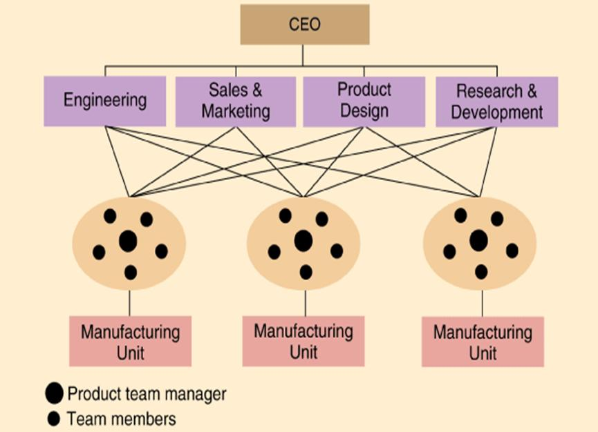
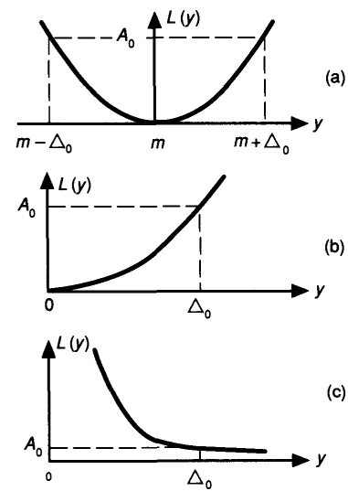

> 题源：`Sample Exam Questions.pdf` 的 `SAMPLE SET 3`。
>
> 参考答案与解析由 GPT-5.5 辅助生成，并结合本站课程笔记与计算复核整理；**非官方答案，仅供参考**。若与课堂讲解或官方答案冲突，以官方答案为准。

## Section A: Multiple Choice Questions

<div class="question-card quiz-card" data-answer="E">

<p class="question-title"><strong>(1.1)</strong> Why do companies use project management? Choose the correct combination of statements. <strong>[2]</strong></p>

<p>1 - To define the project and agree with the customer<br>2 - To estimate project cost and make proposals<br>3 - To assess risk and failure points and make back up plans<br>4 - To allocate the right resource at the right time<br>5 - To track the schedule only once the plan is made</p>

<div class="quiz-options">
<button class="quiz-option" data-option="A" type="button"><span class="quiz-option-letter">A</span><span>1 + 2 + 3 + 5</span></button>
<button class="quiz-option" data-option="B" type="button"><span class="quiz-option-letter">B</span><span>1 + 2 + 4 + 5</span></button>
<button class="quiz-option" data-option="C" type="button"><span class="quiz-option-letter">C</span><span>2 + 3 + 4 + 5</span></button>
<button class="quiz-option" data-option="D" type="button"><span class="quiz-option-letter">D</span><span>1 + 3 + 4 + 5</span></button>
<button class="quiz-option" data-option="E" type="button"><span class="quiz-option-letter">E</span><span>1 + 2 + 3 + 4</span></button>
</div>

<div class="quiz-explanation">
<p><strong class="quiz-answer">参考答案：E</strong></p>
<p>项目管理用于定义项目、估算成本、识别风险并配置资源。第 5 条中的 <em>only once the plan is made</em> 可理解为“只有计划制定后才跟踪”或“计划完成后只跟踪一次”，但无论哪种读法都过于片面：项目进度需要在项目生命周期中持续监控和控制，而不是把 schedule tracking 当作计划完成后的单独动作。</p>
</div>

</div>

---

<div class="question-card quiz-card" data-answer="D">

<p class="question-title"><strong>(1.2)</strong> In a Profit and Loss statement, Earnings before Interest, Tax, Depreciation, and Amortisation is equal to: <strong>[2]</strong></p>

<div class="quiz-options">
<button class="quiz-option" data-option="A" type="button"><span class="quiz-option-letter">A</span><span>Total Sales minus Cost of Sales</span></button>
<button class="quiz-option" data-option="B" type="button"><span class="quiz-option-letter">B</span><span>Total Expenses minus Net Profit</span></button>
<button class="quiz-option" data-option="C" type="button"><span class="quiz-option-letter">C</span><span>Total Sales minus (Salaries + Rent)</span></button>
<button class="quiz-option" data-option="D" type="button"><span class="quiz-option-letter">D</span><span>Gross Profit minus all company operating expenses (salaries and rent etc.)</span></button>
<button class="quiz-option" data-option="E" type="button"><span class="quiz-option-letter">E</span><span>Full production costs minus Net Profit</span></button>
</div>

<div class="quiz-explanation">
<p><strong class="quiz-answer">参考答案：D</strong></p>
<p>PDF 题干标签写作 EBITA，但完整展开包含 depreciation and amortisation，更接近 EBITDA。按课程简化口径，可视作 gross profit 扣除经营费用后、尚未扣除利息和税等项目的收益。</p>
</div>

</div>

---

<div class="question-card quiz-card" data-answer="A">

<p class="question-title"><strong>(1.3)</strong> If a company has an organisational structure as shown below, it is called: <strong>[2]</strong></p>

<p></p>

<div class="quiz-options">
<button class="quiz-option" data-option="A" type="button"><span class="quiz-option-letter">A</span><span>A Team-Based Structure</span></button>
<button class="quiz-option" data-option="B" type="button"><span class="quiz-option-letter">B</span><span>A Matrix Structure</span></button>
<button class="quiz-option" data-option="C" type="button"><span class="quiz-option-letter">C</span><span>A Divisional Structure</span></button>
<button class="quiz-option" data-option="D" type="button"><span class="quiz-option-letter">D</span><span>A Simple Startup Structure</span></button>
<button class="quiz-option" data-option="E" type="button"><span class="quiz-option-letter">E</span><span>A Military Command Structure</span></button>
</div>

<div class="quiz-explanation">
<p><strong class="quiz-answer">参考答案：A</strong></p>
<p>图中 CEO 下方有 Engineering、Sales &amp; Marketing、Product Design、Research &amp; Development 等职能部门，但实际工作通过下方的产品团队/制造单元组织，每个团队包含 product team manager 和 team members，并横向连接多个职能部门。因此更符合 team-based / group-based structure，而不是典型 matrix structure。</p>
</div>

</div>

---

<div class="question-card quiz-card" data-answer="A">

<p class="question-title"><strong>(1.4)</strong> A Sole Trader Company is: <strong>[2]</strong></p>

<div class="quiz-options">
<button class="quiz-option" data-option="A" type="button"><span class="quiz-option-letter">A</span><span>A business you run as an individual. You keep profits after tax and are personally responsible for losses.</span></button>
<button class="quiz-option" data-option="B" type="button"><span class="quiz-option-letter">B</span><span>A business in which you and partners personally share responsibility and profits.</span></button>
<button class="quiz-option" data-option="C" type="button"><span class="quiz-option-letter">C</span><span>A company whose shares can be freely traded on the stock market.</span></button>
<button class="quiz-option" data-option="D" type="button"><span class="quiz-option-letter">D</span><span>An organisation set up to avoid paying tax or having responsibility as a director.</span></button>
<button class="quiz-option" data-option="E" type="button"><span class="quiz-option-letter">E</span><span>A separate legal company whose finances are separate from personal finances.</span></button>
</div>

<div class="quiz-explanation">
<p><strong class="quiz-answer">参考答案：A</strong></p>
<p>Sole trader 是个人经营并承担个人责任的商业形式。</p>
</div>

</div>

---

<div class="question-card quiz-card" data-answer="C">

<p class="question-title"><strong>(1.5)</strong> In a Lease-or-Buy calculation, buying equipment costs 30,000 RMB plus 500 RMB per day. Leasing costs 2,000 RMB per day. What is the maximum length of time you can lease before it is cheaper to buy? <strong>[2]</strong></p>

<div class="quiz-options">
<button class="quiz-option" data-option="A" type="button"><span class="quiz-option-letter">A</span><span>3 days</span></button>
<button class="quiz-option" data-option="B" type="button"><span class="quiz-option-letter">B</span><span>10 days</span></button>
<button class="quiz-option" data-option="C" type="button"><span class="quiz-option-letter">C</span><span>20 days</span></button>
<button class="quiz-option" data-option="D" type="button"><span class="quiz-option-letter">D</span><span>30 days</span></button>
<button class="quiz-option" data-option="E" type="button"><span class="quiz-option-letter">E</span><span>16.333 days</span></button>
</div>

<div class="quiz-explanation">
<p><strong class="quiz-answer">参考答案：C</strong></p>
<p>交叉点：2000d = 30000 + 500d，所以 d = 20。20 天处两者相等，超过 20 天买更便宜。</p>
</div>

</div>

---

<div class="question-card quiz-card" data-answer="B">

<p class="question-title"><strong>(1.6)</strong> If TC = Total Cost, F = Fixed Costs, VC = Variable Cost, SP = Selling Price, R = Revenue, and Q = Quantity, then the breakeven point is defined as: <strong>[2]</strong></p>

<div class="quiz-options">
<button class="quiz-option" data-option="A" type="button"><span class="quiz-option-letter">A</span><span>When F - VC * Q = SP * Q</span></button>
<button class="quiz-option" data-option="B" type="button"><span class="quiz-option-letter">B</span><span>When TC = R</span></button>
<button class="quiz-option" data-option="C" type="button"><span class="quiz-option-letter">C</span><span>When R * Q = SP - VC</span></button>
<button class="quiz-option" data-option="D" type="button"><span class="quiz-option-letter">D</span><span>When TC = F + VC * Q</span></button>
<button class="quiz-option" data-option="E" type="button"><span class="quiz-option-letter">E</span><span>When R = SP * Q</span></button>
</div>

<div class="quiz-explanation">
<p><strong class="quiz-answer">参考答案：B</strong></p>
<p>盈亏平衡点是总收入等于总成本，即利润为零的点。</p>
</div>

</div>

---

<div class="question-card quiz-card" data-answer="D">

<p class="question-title"><strong>(1.7)</strong> What is a Profit & Loss (Income) statement? <strong>[2]</strong></p>

<div class="quiz-options">
<button class="quiz-option" data-option="A" type="button"><span class="quiz-option-letter">A</span><span>It only summarises all sales revenues for the financial year.</span></button>
<button class="quiz-option" data-option="B" type="button"><span class="quiz-option-letter">B</span><span>It only summarises all payments or expenses for the financial year.</span></button>
<button class="quiz-option" data-option="C" type="button"><span class="quiz-option-letter">C</span><span>It is only used when the company makes a loss.</span></button>
<button class="quiz-option" data-option="D" type="button"><span class="quiz-option-letter">D</span><span>It summarises the sales revenues, payments, and expenses for the financial year.</span></button>
<button class="quiz-option" data-option="E" type="button"><span class="quiz-option-letter">E</span><span>It is only used when the company makes a profit.</span></button>
</div>

<div class="quiz-explanation">
<p><strong class="quiz-answer">参考答案：D</strong></p>
<p>P&L statement 汇总一定期间内收入、成本、费用与利润情况。</p>
</div>

</div>

---

<div class="question-card quiz-card" data-answer="C">

<p class="question-title"><strong>(1.8)</strong> In a Profit and Loss statement, Gross Profit is equal to: <strong>[2]</strong></p>

<div class="quiz-options">
<button class="quiz-option" data-option="A" type="button"><span class="quiz-option-letter">A</span><span>Total Expenses minus Net Profit</span></button>
<button class="quiz-option" data-option="B" type="button"><span class="quiz-option-letter">B</span><span>Sales minus Expenses</span></button>
<button class="quiz-option" data-option="C" type="button"><span class="quiz-option-letter">C</span><span>Total Sales minus Cost of Sales</span></button>
<button class="quiz-option" data-option="D" type="button"><span class="quiz-option-letter">D</span><span>Total Sales minus (Salaries + Rent)</span></button>
<button class="quiz-option" data-option="E" type="button"><span class="quiz-option-letter">E</span><span>Full production costs minus Net Profit</span></button>
</div>

<div class="quiz-explanation">
<p><strong class="quiz-answer">参考答案：C</strong></p>
<p>Gross Profit = Sales Revenue - Cost of Sales。</p>
</div>

</div>

---

<div class="question-card quiz-card" data-answer="B">

<p class="question-title"><strong>(1.9)</strong> If a company is described as having a “Defender” strategic posture, which characteristics apply? <strong>[2]</strong></p>

<div class="quiz-options">
<button class="quiz-option" data-option="A" type="button"><span class="quiz-option-letter">A</span><span>Pioneering changes; aggressively explore new markets; organic and flexible; multiple prototypical technologies.</span></button>
<button class="quiz-option" data-option="B" type="button"><span class="quiz-option-letter">B</span><span>Stability and efficiency; maintain a small niche; mechanistic, hierarchical, centralised, and controlled; one core highly cost-efficient technology.</span></button>
<button class="quiz-option" data-option="C" type="button"><span class="quiz-option-letter">C</span><span>Balanced risks and profits; defend core business while cautiously exploiting proven new markets; matrix organisation.</span></button>
<button class="quiz-option" data-option="D" type="button"><span class="quiz-option-letter">D</span><span>Reluctant to act due to instability and uncertainty; unsure market focus and technology.</span></button>
<button class="quiz-option" data-option="E" type="button"><span class="quiz-option-letter">E</span><span>Stability and efficiency while aggressively exploring new market opportunities with organic structure.</span></button>
</div>

<div class="quiz-explanation">
<p><strong class="quiz-answer">参考答案：B</strong></p>
<p>Defender 强调稳定、效率、明确市场利基、机械式控制结构和核心高效技术。</p>
</div>

</div>

---

<div class="question-card quiz-card" data-answer="C">

<p class="question-title"><strong>(1.10)</strong> Design for Manufacturing is most effective at which stage? <strong>[2]</strong></p>

<div class="quiz-options">
<button class="quiz-option" data-option="A" type="button"><span class="quiz-option-letter">A</span><span>Production stage, because the product can be changed promptly.</span></button>
<button class="quiz-option" data-option="B" type="button"><span class="quiz-option-letter">B</span><span>Product launch, because of highest impact and lowest cost of changes.</span></button>
<button class="quiz-option" data-option="C" type="button"><span class="quiz-option-letter">C</span><span>Initial design, because of the highest impact and lowest cost of changes.</span></button>
<button class="quiz-option" data-option="D" type="button"><span class="quiz-option-letter">D</span><span>After initial design and before production when final design is being finalized.</span></button>
<button class="quiz-option" data-option="E" type="button"><span class="quiz-option-letter">E</span><span>All stages after design because customer requirements are completely recognized.</span></button>
</div>

<div class="quiz-explanation">
<p><strong class="quiz-answer">参考答案：C</strong></p>
<p>设计早期变更成本最低且影响最大，因此 DFM 应尽早介入。</p>
</div>

</div>

---

<div class="question-card quiz-card" data-answer="D">

<p class="question-title"><strong>(1.11)</strong> There is a variety of actionable sustainable design principles. Which one below is the exception? <strong>[2]</strong></p>

<div class="quiz-options">
<button class="quiz-option" data-option="A" type="button"><span class="quiz-option-letter">A</span><span>Dematerialization.</span></button>
<button class="quiz-option" data-option="B" type="button"><span class="quiz-option-letter">B</span><span>Migration to product-service systems.</span></button>
<button class="quiz-option" data-option="C" type="button"><span class="quiz-option-letter">C</span><span>Limit or eliminate long-distance outsourcing.</span></button>
<button class="quiz-option" data-option="D" type="button"><span class="quiz-option-letter">D</span><span>Design for a shorter period of usage.</span></button>
<button class="quiz-option" data-option="E" type="button"><span class="quiz-option-letter">E</span><span>Invest in simulation.</span></button>
</div>

<div class="quiz-explanation">
<p><strong class="quiz-answer">参考答案：D</strong></p>
<p>可持续设计通常鼓励延长寿命而非缩短使用周期。</p>
</div>

</div>

---

<div class="question-card quiz-card" data-answer="A">

<p class="question-title"><strong>(1.12)</strong> Which statement about a Pareto chart is true? <strong>[2]</strong></p>

<div class="quiz-options">
<button class="quiz-option" data-option="A" type="button"><span class="quiz-option-letter">A</span><span>It is a bar graph that displays the relative frequency or size of problems in descending order of importance.</span></button>
<button class="quiz-option" data-option="B" type="button"><span class="quiz-option-letter">B</span><span>It is a line graph showing cumulative percentage plotted against total number of occurrences.</span></button>
<button class="quiz-option" data-option="C" type="button"><span class="quiz-option-letter">C</span><span>It is a scatter plot that indicates correlation between two variables.</span></button>
<button class="quiz-option" data-option="D" type="button"><span class="quiz-option-letter">D</span><span>It is a pie chart that breaks down problems into categories.</span></button>
<button class="quiz-option" data-option="E" type="button"><span class="quiz-option-letter">E</span><span>None of the above.</span></button>
</div>

<div class="quiz-explanation">
<p><strong class="quiz-answer">参考答案：A</strong></p>
<p>Pareto chart 用降序柱状图展示问题频率/影响，常配累计百分比线。</p>
</div>

</div>

## Section B: Long Questions

### Q2 Tower Crane Project

A tower crane is required for installation work at a new airport station. Tasks, durations, and predecessors are given below.

| Task | Description | Duration | Predecessors |
| ---: | --- | ---: | --- |
| 0 | Project Start | 0 | - |
| 1 | Specify Crane | 3 | 0 |
| 2 | Survey Site | 4 | 1 |
| 3 | Survey Power Supply | 3 | 1 |
| 4 | Select Site | 1 | 2 |
| 5 | Order Tower Crane | 2 | 3, 4 |
| 6 | Arrange Transport | 4 | 5 |
| 7 | Order Mobile Erector Crane | 3 | 5 |
| 8 | Install Concrete Plinth | 5 | 5 |
| 9 | Confirm Site Access | 1 | 6, 7, 8 |
| 10 | Get Mobile Erector Crane on Site | 4 | 9 |
| 11 | Crane Parts on Site | 5 | 9 |
| 12 | Install Crane Base | 2 | 10, 11 |
| 13 | Install Tower & Crane Head | 1 | 12 |
| 14 | Assemble Jib | 2 | 10, 11 |
| 15 | Install Jib | 1 | 12, 13 |
| 16 | Install counterweight | 1 | 15 |
| 17 | Apply Crane Power | 1 | 16 |
| 18 | Test Crane | 1 | 17 |
| 19 | Project end | 0 | 18 |

(a) Show the information on a network diagram. **[8]**

(b) Using the network diagram, list the critical path and calculate the duration. **[5]**

(c) Develop a Gantt chart showing all tasks, interdependencies, slack time, and critical path. **[7]**

(d) If Task 8 cannot start until Task 7 is completed, calculate the new duration and describe the impact. Comment on the usefulness of a Gantt chart when changes occur. **[5]**

<details>
<summary>展示参考答案</summary>

**(a) Network diagram**

可按 predecessor 表画 activity-on-node 网络。文字版关系为：

```text
0 -> 1
1 -> 2, 3
2 -> 4
3,4 -> 5
5 -> 6, 7, 8
6,7,8 -> 9
9 -> 10, 11
10,11 -> 12 and 14
12 -> 13
12,13 -> 15
15 -> 16 -> 17 -> 18 -> 19
```

**(b) CPM table**

| Task | ES | EF | LS | LF | Float |
| ---: | ---: | ---: | ---: | ---: | ---: |
| 0 | 0 | 0 | 0 | 0 | 0 |
| 1 | 0 | 3 | 0 | 3 | 0 |
| 2 | 3 | 7 | 3 | 7 | 0 |
| 3 | 3 | 6 | 5 | 8 | 2 |
| 4 | 7 | 8 | 7 | 8 | 0 |
| 5 | 8 | 10 | 8 | 10 | 0 |
| 6 | 10 | 14 | 11 | 15 | 1 |
| 7 | 10 | 13 | 12 | 15 | 2 |
| 8 | 10 | 15 | 10 | 15 | 0 |
| 9 | 15 | 16 | 15 | 16 | 0 |
| 10 | 16 | 20 | 17 | 21 | 1 |
| 11 | 16 | 21 | 16 | 21 | 0 |
| 12 | 21 | 23 | 21 | 23 | 0 |
| 13 | 23 | 24 | 23 | 24 | 0 |
| 14 | 21 | 23 | 26 | 28 | 5 |
| 15 | 24 | 25 | 24 | 25 | 0 |
| 16 | 25 | 26 | 25 | 26 | 0 |
| 17 | 26 | 27 | 26 | 27 | 0 |
| 18 | 27 | 28 | 27 | 28 | 0 |
| 19 | 28 | 28 | 28 | 28 | 0 |

Critical path:

$$
0 \rightarrow 1 \rightarrow 2 \rightarrow 4 \rightarrow 5 \rightarrow 8 \rightarrow 9 \rightarrow 11 \rightarrow 12 \rightarrow 13 \rightarrow 15 \rightarrow 16 \rightarrow 17 \rightarrow 18 \rightarrow 19
$$

Project duration is **28 days**.

**(c) Gantt chart answer**

在 Gantt chart 中，把每个 task 按 ES 到 EF 绘制。关键任务标红或加粗，非关键任务显示 float：Task 3 has 2 days float, Task 6 has 1 day, Task 7 has 2 days, Task 10 has 1 day, Task 14 has 5 days.

注意：以上严格按 PDF 表格的 predecessors 计算。PDF 中 Task 14 “Assemble Jib” 没有作为 Task 15 的 predecessor，因此它在该计算中是一个非关键终端活动。按工程逻辑，“Assemble Jib” 很可能应先于 “Install Jib”；若把 Task 14 也作为 Task 15 的 predecessor，则项目总工期仍为 28 天，但 Task 14 的 float 会变为 1 天。

**(d) Change to Task 8 dependency**

If Task 8 depends on Task 7, Task 8 shifts from `ES = 10` to `ES = 13`, and Task 9 shifts to start at day 18. New project duration becomes **31 days**.

New critical path:

$$
0 \rightarrow 1 \rightarrow 2 \rightarrow 4 \rightarrow 5 \rightarrow 7 \rightarrow 8 \rightarrow 9 \rightarrow 11 \rightarrow 12 \rightarrow 13 \rightarrow 15 \rightarrow 16 \rightarrow 17 \rightarrow 18 \rightarrow 19
$$

The project is delayed by **3 days**. A Gantt chart is useful because it makes schedule shifts, dependencies, slack, and critical-path impact visible to the project manager.

</details>

### Q3 DFM, Quality, Robust Design, Six Sigma

#### Q3(h) DFM and 4Rs

(iv) Describe briefly any two DFM principles from Simplicity, Standardization, Tolerance, Material Selection, Automation, and Process Integration. **[4]**

(v) List any two 4R principles. **[2]**

<details>
<summary>展示参考答案</summary>

Example DFM principles:

| Principle | Explanation |
| --- | --- |
| Simplicity | Reduce the number of parts and simplify shapes so products are easier and cheaper to manufacture and assemble. |
| Standardization | Use standard parts, dimensions, and processes to reduce inventory, tooling, training, and procurement complexity. |

Other valid answers include tolerance control, appropriate material selection, automation-friendly design, and process integration.

Any two 4Rs: **Reduce, Reuse, Recycle, Repair**.

</details>

#### Q3(i) 7QC Tools

(i) List any four of the seven quality control tools. **[4]**

(ii) A PCB manufacturer monitors defect rate over time and plots the trend. Which quality tool is used? **[1]**

(iii) In that tool, what exactly do you see if the process is unstable? **[2]**

<details>
<summary>展示参考答案</summary>

Four 7QC tools can include: Cause-and-Effect Diagram, Check Sheet, Control Chart, Histogram, Pareto Chart, Scatter Diagram, and Flowchart/Stratification.

For monitoring defect rate over time, the appropriate tool is a **Control Chart**.

If the process is unstable, the control chart may show points outside UCL/LCL, long runs on one side of the center line, clear upward/downward trends, cycles, or other non-random patterns. These indicate special-cause variation.

</details>

#### Q3(j) Robust Design

Figure Q3 shows different forms of the quadratic loss function. List the name of any two loss functions and explain any two types of noise factors. **[6]**

<p></p>

<details>
<summary>展示参考答案</summary>

The three common Taguchi loss functions shown are:

| Plot | Name | Meaning |
| --- | --- | --- |
| (a) | Nominal-the-best | Loss increases as the response moves away from target m. |
| (b) | Smaller-the-better | Lower response is preferred; loss increases as y increases. |
| (c) | Larger-the-better | Higher response is preferred; loss decreases as y increases. |

Any two names are sufficient.

Noise factors are causes of variation that affect product performance. Common categories include:

| Noise factor | Explanation |
| --- | --- |
| External noise | Variation from user environment, temperature, humidity, vibration, voltage supply, etc. |
| Internal noise / deterioration | Variation caused by ageing, wear, material degradation, or long-term use. |
| Unit-to-unit variation | Manufacturing variation between individual units due to tolerances and process variation. |

</details>

#### Q3(k) Six Sigma

(i) List any of the five main phases in Six Sigma. **[2]**

(ii) Explain briefly any two Six Sigma roles. **[4]**

<details>
<summary>展示参考答案</summary>

The five DMAIC phases are **Define, Measure, Analyze, Improve, Control**. Any listed phases are acceptable.

Example Six Sigma roles:

| Role | Explanation |
| --- | --- |
| Executive Leadership | Sets strategic direction, provides resources, and supports Six Sigma deployment. |
| Champion | Owns project selection and removes organizational barriers. |
| Master Black Belt | Coaches Black Belts and Green Belts, maintains methodology standards, and leads complex improvement work. |
| Black Belt | Leads Six Sigma projects full-time using statistical and project management tools. |
| Green Belt | Supports projects part-time while working in operational roles. |

</details>

### Q4 Break-even and Make-or-Buy

(a) Derive the theoretical break-even revenue relationship. **[3]**

XYZ requires `17,500` optical transceivers annually. External supplier price is `57 RMB` each. Vacant facilities add fixed overhead of `568,750 RMB`. Currently, facilities are rented for `225,000 RMB` per year, but the agreement is nearing expiry.

(b) Compare purchasing cost while facilities are rented vs after rental expires. **[5]**

(c) Internal manufacturing variable costs are: Direct Materials `22.50 RMB`, Direct Labour `12.50 RMB`, Variable Overhead `2.50 RMB`. Decide whether to buy or make. **[5]**

(d) If selling price is `78.125 RMB`, draw a cost/revenue table from `3,500 -> 17,500` in increments of `3,500`. **[5]**

(e) At full capacity, calculate profit and safety margin. **[3]**

(f) Draw a breakeven graph and calculate the breakeven point. **[5]**

<details>
<summary>展示参考答案</summary>

**(a) Break-even relationship**

Revenue equals total cost:

$$
SP\times Q = FC + VC\times Q
$$

Therefore:

$$
Q_{BE}=\frac{FC}{SP-VC}
$$

and break-even revenue is:

$$
R_{BE}=SP\times Q_{BE}
$$

**(b) External purchase scenarios**

Annual purchase cost:

$$
17,500\times57=997,500\ \text{RMB}
$$

| Scenario | Purchase cost | Fixed overhead | Rental income | Equivalent annual cost |
| --- | ---: | ---: | ---: | ---: |
| Facilities rented | 997,500 | 568,750 | -225,000 | 1,341,250 |
| Rental expired | 997,500 | 568,750 | 0 | 1,566,250 |

**(c) Internal manufacturing**

Variable cost per transceiver:

$$
22.5+12.5+2.5=37.5\ \text{RMB}
$$

Annual internal manufacturing cost:

$$
17,500\times37.5+568,750=1,225,000\ \text{RMB}
$$

Compared with external purchase after rental expires (`1,566,250 RMB`), making internally is cheaper by `341,250 RMB`. Even compared with buying while rented (`1,341,250 RMB`), making internally is cheaper by `116,250 RMB`. Therefore, make internally.

**(d) Cost/revenue table**

$$
TC=568,750+37.5Q
$$

$$
REV=78.125Q
$$

| Quantity | Total Cost (RMB) | Revenue (RMB) | Profit (RMB) |
| ---: | ---: | ---: | ---: |
| 3,500 | 700,000.0 | 273,437.5 | -426,562.5 |
| 7,000 | 831,250.0 | 546,875.0 | -284,375.0 |
| 10,500 | 962,500.0 | 820,312.5 | -142,187.5 |
| 14,000 | 1,093,750.0 | 1,093,750.0 | 0.0 |
| 17,500 | 1,225,000.0 | 1,367,187.5 | 142,187.5 |

**(e) Profit and safety margin**

At full capacity, profit is:

$$
1,367,187.5-1,225,000=142,187.5\ \text{RMB}
$$

Break-even quantity:

$$
Q_{BE}=\frac{568,750}{78.125-37.5}=14,000
$$

Safety margin:

$$
17,500-14,000=3,500\ \text{transceivers}=20\%
$$

**(f) Graph**

Plot `FC = 568,750`, `VC = 37.5Q`, `TC = 568,750 + 37.5Q`, and `REV = 78.125Q`. Mark the intersection at **14,000 transceivers** and **1,093,750 RMB** revenue/cost.

</details>
