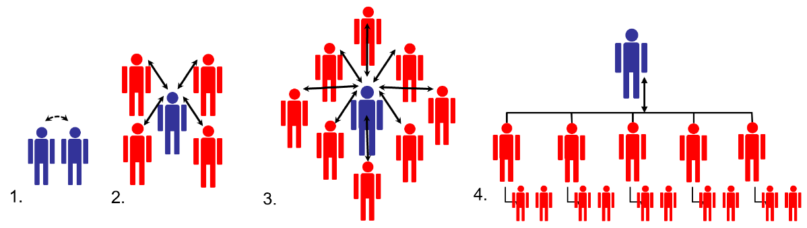
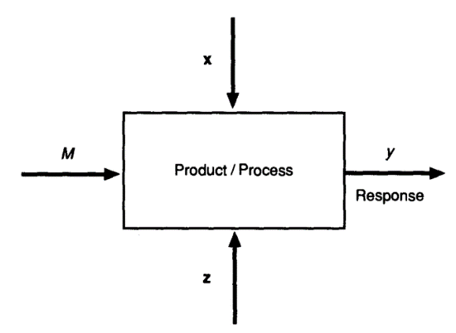

> 题源：`Sample Exam Questions.pdf` 的 `SAMPLE SET 5`。
>
> 参考答案与解析由 GPT-5.5 辅助生成，并结合本站课程笔记与计算复核整理；**非官方答案，仅供参考**。若与课堂讲解或官方答案冲突，以官方答案为准。

## Section A: Multiple Choice Questions

<strong>(1.1)</strong> What is a critical path? <strong>[2]</strong>

<button class="quiz-option" data-option="A" type="button">AThe longest path through the project network with the least amount of slack</button>
<button class="quiz-option" data-option="B" type="button">BThe shortest path through the project network with the maximum amount of slack</button>
<button class="quiz-option" data-option="C" type="button">CThe shortest path through the project network with the least amount of slack</button>
<button class="quiz-option" data-option="D" type="button">DThe shortest chain of tasks that considers both task dependencies and resource dependencies</button>
<button class="quiz-option" data-option="E" type="button">EThe longest chain of tasks that considers both task dependencies and resource dependencies</button>

<strong class="quiz-answer">参考答案：A</strong>

关键路径是项目网络中决定最短项目工期的最长路径，通常总浮动为 0 或最小。

---

<strong>(1.2)</strong> Consider the structure of a start-up company run by an entrepreneur. Find the correct pair of true statements. <strong>[2]</strong>

1. Maximum standardisation and formalisation 2. Few layers: limited middle-line managerial levels 3. Decentralised and indirect supervision 4. A wide span of control around the entrepreneur

<button class="quiz-option" data-option="A" type="button">A1 and 2</button>
<button class="quiz-option" data-option="B" type="button">B3 and 4</button>
<button class="quiz-option" data-option="C" type="button">C2 and 3</button>
<button class="quiz-option" data-option="D" type="button">D2 and 4</button>
<button class="quiz-option" data-option="E" type="button">E1 and 3</button>

<strong class="quiz-answer">参考答案：D</strong>

初创企业结构层级少，创业者直接监督且控制幅度宽；它通常不是高度标准化或去中心化。

---

<strong>(1.3)</strong> The following organisational structures should be labelled as: <strong>[2]</strong>

<button class="quiz-option" data-option="A" type="button">A1. Start-up; 2. Expansion; 3. Growth; 4. Formal Organisation</button>
<button class="quiz-option" data-option="B" type="button">B1. Expansion; 2. Start-up; 3. Formal Organisation; 4. Growth</button>
<button class="quiz-option" data-option="C" type="button">C1. Start-up; 2. Growth; 3. Expansion; 4. Formal Organisation</button>
<button class="quiz-option" data-option="D" type="button">D1. Expansion; 2. Start-up; 3. Growth; 4. Formal Organisation</button>
<button class="quiz-option" data-option="E" type="button">E1. Growth; 2. Start-up; 3. Formal Organisation; 4. Expansion</button>

<strong class="quiz-answer">参考答案：A</strong>

四个图依次对应初创、扩张、增长和正式组织。

---

<strong>(1.4)</strong> A project has more than one critical path. What does this mean? <strong>[2]</strong>

<button class="quiz-option" data-option="A" type="button">ARisk increases</button>
<button class="quiz-option" data-option="B" type="button">BRisk decreases</button>
<button class="quiz-option" data-option="C" type="button">CThe duration of the project reduces</button>
<button class="quiz-option" data-option="D" type="button">DThe project may cost less</button>
<button class="quiz-option" data-option="E" type="button">ENothing happens</button>

<strong class="quiz-answer">参考答案：A</strong>

多个关键路径意味着多个活动链都无浮动，任一路径延误都可能延误项目，因此进度风险增加。

---

<strong>(1.5)</strong> Which document is created by breaking a project scope into smaller and more manageable elements? <strong>[2]</strong>

<button class="quiz-option" data-option="A" type="button">AScope baseline</button>
<button class="quiz-option" data-option="B" type="button">BOrganisational breakdown structure (OBS)</button>
<button class="quiz-option" data-option="C" type="button">CWork breakdown structure (WBS)</button>
<button class="quiz-option" data-option="D" type="button">DStatement of work (SOW)</button>
<button class="quiz-option" data-option="E" type="button">EBudget report</button>

<strong class="quiz-answer">参考答案：C</strong>

WBS 把项目范围分解为更小、更易管理的工作包。

---

<strong>(1.6)</strong> In the execution phase, key resources are lost and new staff join. What should be the most important agenda item for the new team meeting? <strong>[2]</strong>

<button class="quiz-option" data-option="A" type="button">ADiscussing team building activities</button>
<button class="quiz-option" data-option="B" type="button">BReviewing WBS and responsibilities of all team members</button>
<button class="quiz-option" data-option="C" type="button">CInviting team members to share past project experiences</button>
<button class="quiz-option" data-option="D" type="button">DPlanning risk responses for existing risks</button>
<button class="quiz-option" data-option="E" type="button">EAll of the above</button>

<strong class="quiz-answer">参考答案：B</strong>

人员变化后最先要保证工作范围、工作包和责任分配清楚。

---

<strong>(1.7)</strong> Hand tools cost 1000 RMB plus 1.50 RMB/unit. Automated machinery costs 15,000 RMB plus 0.50 RMB/unit. Annual production is 5000 units. How long to reach cross-over? <strong>[2]</strong>

<button class="quiz-option" data-option="A" type="button">A2.0 yr</button>
<button class="quiz-option" data-option="B" type="button">BNever</button>
<button class="quiz-option" data-option="C" type="button">C3.6 yr</button>
<button class="quiz-option" data-option="D" type="button">D2.8 yr</button>
<button class="quiz-option" data-option="E" type="button">E0.9 yr</button>

<strong class="quiz-answer">参考答案：D</strong>

固定成本差 14,000，单位节省 1 RMB，交叉点 14,000 件，即 2.8 年。

---

<strong>(1.8)</strong> Which item below is not correct regarding DFM? <strong>[2]</strong>

<button class="quiz-option" data-option="A" type="button">AThe time required for DFM depends on product complexity, organization size, and resources.</button>
<button class="quiz-option" data-option="B" type="button">BDFM is a continuous process beginning at initial design and continuing through the lifecycle.</button>
<button class="quiz-option" data-option="C" type="button">CDFM is more effective in initial design because impact is highest and change cost is lowest.</button>
<button class="quiz-option" data-option="D" type="button">DDFM may impose higher manufacturing costs, instead can benefit from higher customer satisfaction because of improved quality.</button>
<button class="quiz-option" data-option="E" type="button">EDFM includes principles such as simplicity, standardization, tolerance, material selection, automation, and process integration.</button>

<strong class="quiz-answer">参考答案：D</strong>

DFM 的主要目标之一是降低制造成本和复杂度；D 的表述与该核心目标相反。

---

<strong>(1.9)</strong> In new product development, the impact on Price, Quality, and Manufacturing time is: <strong>[2]</strong>

<button class="quiz-option" data-option="A" type="button">AProduct Development: 20-30%, Manufacturing: 70-80%</button>
<button class="quiz-option" data-option="B" type="button">BProduct Development: 70-80%, Manufacturing: 20-30%</button>
<button class="quiz-option" data-option="C" type="button">CProduct Development: 50%, Manufacturing: 50%</button>
<button class="quiz-option" data-option="D" type="button">DSales & Marketing: 33.3%, Product Development: 33.3%, Manufacturing: 33.3%</button>
<button class="quiz-option" data-option="E" type="button">ESales & Marketing: 50%, Product Development: 50%</button>

<strong class="quiz-answer">参考答案：B</strong>

课程强调产品开发阶段决定约 70-80% 的价格、质量和制造时间影响。

---

<strong>(1.10)</strong> Which statement best fits the definition of control charts? <strong>[2]</strong>

<button class="quiz-option" data-option="A" type="button">AControl charts determine whether a process is stable and predictable over time.</button>
<button class="quiz-option" data-option="B" type="button">BThey determine whether a process is profitable.</button>
<button class="quiz-option" data-option="C" type="button">CThey determine whether a process is meeting customer demand.</button>
<button class="quiz-option" data-option="D" type="button">DThey determine whether a process is efficient.</button>
<button class="quiz-option" data-option="E" type="button">ENone of the above.</button>

<strong class="quiz-answer">参考答案：A</strong>

控制图用于判断过程随时间是否稳定、可预测。

---

<strong>(1.11)</strong> Which statement is true regarding process capability? <strong>[2]</strong>

<button class="quiz-option" data-option="A" type="button">AIt measures process efficiency in time and resources.</button>
<button class="quiz-option" data-option="B" type="button">BIt is the degree to which a process can consistently produce output meeting specifications.</button>
<button class="quiz-option" data-option="C" type="button">CIt is determined solely by worker skill level.</button>
<button class="quiz-option" data-option="D" type="button">DIt is not relevant for service industries.</button>
<button class="quiz-option" data-option="E" type="button">ENone of the above.</button>

<strong class="quiz-answer">参考答案：B</strong>

过程能力描述过程稳定产出满足规格要求结果的能力。

---

<strong>(1.12)</strong> The three variables of the project planning process are: <strong>[2]</strong>

<button class="quiz-option" data-option="A" type="button">ACost, Time, Performance</button>
<button class="quiz-option" data-option="B" type="button">BPrice, Delivery, Quality</button>
<button class="quiz-option" data-option="C" type="button">CPower, Speed, Cost</button>
<button class="quiz-option" data-option="D" type="button">DSlack Time, Tasks, Resources</button>
<button class="quiz-option" data-option="E" type="button">EManpower, Critical Path, Temperature</button>

<strong class="quiz-answer">参考答案：A</strong>

项目计划常围绕 cost、time、performance/scope 进行权衡。

## Section B: Long Questions

### Q2 Discounted Cash Flow

As a young entrepreneur, you would like to guarantee a healthy total cost of ownership via evaluating the net present value of your young company while utilising discounted cash flow analysis.

**(a)** Your company is designing a new product that will take three years to design, fabricate, and build. Expenses are `1,000,000 RMB` per year and will increase with an inflation rate of `5%` annually. How much must your company quote the customer for delivery in three years if it wants to cover expenses and earn a net profit, in today's equivalent currency, of `100,000 RMB`? **[3]**

**(b)** Your company would like to purchase a new machine with purchase price `10 M RMB` and lifetime `5 years`. The machine requires annual maintenance cost `1 M RMB` and annual power cost `0.5 M RMB`. All costs are fixed, with inflation of `10%` applied to power only after year 1.

(i) Demonstrate the total projected costs over the lifetime. **[3]**

(ii) Analyse the total cost of ownership over the lifetime. **[4]**

**(c)** Your company is considering setting up a large assembly facility in Chengdu. Initial setup cost is `6,398 M RMB`. Forecast net income is: Y1 `1,400 M`, Y2 `1,450 M`, Y3 `1,550 M`, Y4 `1,625 M`, Y5 `1,480 M`.

(i) Calculate projected payback time to the nearest month. **[5]**

(ii) Calculate NPV using a discount factor of `5%`. **[7]**

(iii) Comment on attractiveness. **[3]**

展示参考答案

**(a)** Three-year quote with 5% inflation and 100,000 RMB profit in today's equivalent currency:

$$
1,000,000+1,050,000+1,102,500+100,000(1.05)^3=3,268,262.50\ \text{RMB}
$$

**(b)** Machine TCO: purchase `10 M`, maintenance `5 M`, power `0.5 + 0.55 + 0.605 + 0.6655 + 0.73205 = 3.05255 M`; total **18.05255 M RMB**.

**(c)** Chengdu facility: payback occurs after year 4 plus `373/(1480/12)=3.02` months, so about **51 months**. NPV at 5% is approximately **85.98 M RMB**, so the project is attractive but only with a modest positive margin.

### Q3 DFM, Quality, Robust Design, Six Sigma

#### Q3(p) DFM and Sustainability

DFM is the process of designing components for ease of manufacturing high-quality products at a lower cost.

(viii) The product development cycle consists of initial design, final design, fabrication, production, and product launch. Which stage is more effective in DFM regarding the impact and cost of changes? **[3]**

(ix) Sustainability can balance three main pillars. List any two of these pillars. **[2]**

展示参考答案

The most effective DFM stage is **initial design**, because design changes have the highest impact and the lowest cost early in the product development cycle.

Any two sustainability pillars: **environmental**, **economic**, **social**.

#### Q3(q) Quality Control

The goal of Quality Control (QC) is to identify defects after a product is developed but before it is released to production. The seven basic quality-control tools can be used to manage product or process quality effectively.

(vii) List any two of the 7-QC tools. **[2]**

(viii) A company that produces electronic devices is experiencing a high rate of product returns due to defects. How might a cause-effect diagram be used to identify the root causes of these defects? **[4]**

(ix) The cost of quality can be categorized as Prevention Cost, Appraisal Cost, Internal Failure Cost, and External Failure Cost. Classify quality-related training, and product recall and warranty repairs. **[2]**

展示参考答案

Any two 7QC tools: Cause-and-Effect Diagram, Check Sheet, Control Chart, Histogram, Pareto Chart, Scatter Diagram, Flowchart/Stratification.

A cause-effect diagram can identify root causes of high product returns by putting “product returns due to defects” at the fish head, then grouping possible causes under categories such as Machines, Materials, Methods, Manpower, Measurement, and Environment. Each branch can be expanded into specific causes, such as poor calibration, defective components, unclear work instructions, or operator training gaps.

Cost classification:

| Cost | Category |
| --- | --- |
| Quality-related training | Prevention Cost |
| Product recall and warranty repairs | External Failure Cost |

#### Q3(r) Robust Design

Robust Design is an engineering methodology for improving productivity during research and development so that high-quality products can be produced quickly and at low cost.

(v) From the viewpoint of robust design, an engineering design problem can be optimized through three main steps. List any two of these steps. **[2]**

(vi) The product response is denoted by `y`. Three classes of parameters, shown in Figure Q3(c) as `Z`, `M`, and `X`, can influence the response or quality characteristic. List any two of them. **[2]**

(vii) A product engineer collected 10 observations for a nominal-the-best quality characteristic. The target point is `8.5`; use Taguchi loss with constant `k = 1` and compute the loss for the data set. **[3]**

| Observation | Measurement | Observation | Measurement |
| --- | ---: | --- | ---: |
| 1 | 8.100 | 6 | 8.350 |
| 2 | 8.900 | 7 | 8.250 |
| 3 | 8.450 | 8 | 8.680 |
| 4 | 9.250 | 9 | 8.900 |
| 5 | 8.860 | 10 | 9.050 |

展示参考答案

Robust design optimization commonly includes three steps: **system design**, **parameter design**, and **tolerance design**. Any two are acceptable.

In the parameter diagram, the response `y` is influenced by:

| Symbol | Meaning |
| --- | --- |
| M | Signal factor / intended input |
| X | Control factors / design parameters |
| Z | Noise factors / uncontrollable variation |

For the 10 observations with target `m = 8.5` and `k = 1`, Taguchi nominal-the-best loss is:

$$
L(y)=(y-8.5)^2
$$

| Observation | y | Loss |
| --- | ---: | ---: |
| 1 | 8.10 | 0.1600 |
| 2 | 8.90 | 0.1600 |
| 3 | 8.45 | 0.0025 |
| 4 | 9.25 | 0.5625 |
| 5 | 8.86 | 0.1296 |
| 6 | 8.35 | 0.0225 |
| 7 | 8.25 | 0.0625 |
| 8 | 8.68 | 0.0324 |
| 9 | 8.90 | 0.1600 |
| 10 | 9.05 | 0.3025 |

Total loss:

$$
\sum L(y)=1.5945
$$

#### Q3(s) Six Sigma and Process Capability

Six Sigma measures a process in terms of defects; at the six-sigma level, there are 3.4 defects per million opportunities.

(iii) What is Critical-to-Quality (CTQ)? **[2]**

(iv) A manufacturing process produces a new product with specified length `20 ± 1 mm`. The process has mean diameter `19.8 mm` and standard deviation `0.2 mm`. Calculate the process capability index `Cpk`. **[3]**

展示参考答案

Critical-to-Quality (CTQ) refers to the measurable product or process characteristics that are critical to customer requirements, quality, and satisfaction.

For `20 ± 1 mm`, `USL = 21`, `LSL = 19`, mean `μ = 19.8`, and `σ = 0.2`:

$$
C_{pk}=\min\left(\frac{21-19.8}{3(0.2)},\frac{19.8-19}{3(0.2)}\right)=\min(2.00,1.33)=1.33
$$

The process is generally capable, but the mean is shifted toward the lower specification limit, so centering should be improved.

### Q4 Router Break-even and Make-or-Buy

ABC manufacturing has annual capacity `45,000` routers. Cost breakdown:

| Cost category | Annual Cost (RMB) |
| --- | ---: |
| Direct Materials | 405,000 |
| Direct Labour | 225,000 |
| Variable Overhead | 45,000 |
| Fixed Overhead Cost | 562,500 |
| Total | 1,237,500 |

Outside supplier price is `27.5 RMB` per router.

The fixed overhead cost will **not** be avoided if routers are purchased from the outside supplier because the company has no other use for the vacant production facilities. Later, assume the manager can rent out the facilities for `570,000 RMB` per year.

(a) Derive the theoretical break-even point relationship. **[3]**

(b) Compare the cost of making internally on a per-router basis with buying externally. Should the company purchase from the outside supplier? **[5]**

(c) Include the facility rental impact. Does this change the recommendation? **[5]**

(d) If routers can be sold for `40.00 RMB` each, draw a production cost and sales revenue table for quantities `10,000 -> 30,000` in `5,000` increments. **[5]**

(e) At full capacity `45,000` routers per year with price `40.00 RMB`, calculate profit and safety margin. **[3]**

(f) Draw a break-even graph showing `TC`, `VC`, `FC`, and `REV` against quantity. Calculate and mark the break-even point. **[5]**

展示参考答案

**(a) Break-even relationship**

$$
SP\times Q = FC + VC\times Q
$$

$$
Q_{BE}=\frac{FC}{SP-VC}
$$

**(b) Make-or-buy without rental**

Variable cost per router:

$$
\frac{405,000+225,000+45,000}{45,000}=15\ \text{RMB}
$$

Full internal cost per router is `1,237,500/45,000 = 27.5 RMB`, but fixed overhead is unavoidable. Relevant make cost is 15 RMB/unit, lower than the supplier price 27.5 RMB/unit. Therefore, make internally.

**(c) With facility rental**

If buying externally allows rental income of 570,000 RMB:

| Option | Net annual cost |
| --- | ---: |
| Make internally | 1,237,500 |
| Buy externally + fixed overhead - rental income | 1,237,500 + 562,500 - 570,000 = 1,230,000 |

With rental income, buying externally is cheaper by `7,500 RMB`, so the recommendation changes to buy externally.

**(d) Cost and revenue table at price 40 RMB**

$$
TC=562,500+15Q,\quad REV=40Q
$$

| Quantity | Total Cost | Revenue | Profit |
| ---: | ---: | ---: | ---: |
| 10,000 | 712,500 | 400,000 | -312,500 |
| 15,000 | 787,500 | 600,000 | -187,500 |
| 20,000 | 862,500 | 800,000 | -62,500 |
| 25,000 | 937,500 | 1,000,000 | 62,500 |
| 30,000 | 1,012,500 | 1,200,000 | 187,500 |

**(e) Full capacity profit and safety margin**

At 45,000 units:

$$
REV=45,000\times40=1,800,000
$$

$$
Profit=1,800,000-1,237,500=562,500\ \text{RMB}
$$

Break-even quantity:

$$
Q_{BE}=\frac{562,500}{40-15}=22,500\ \text{routers}
$$

Safety margin = `45,000 - 22,500 = 22,500 routers`, or **50%**.

**(f) Graph**

Plot `FC = 562,500`, `VC = 15Q`, `TC = 562,500 + 15Q`, and `REV = 40Q`. Mark break-even at **22,500 routers** and **900,000 RMB** revenue/cost.

