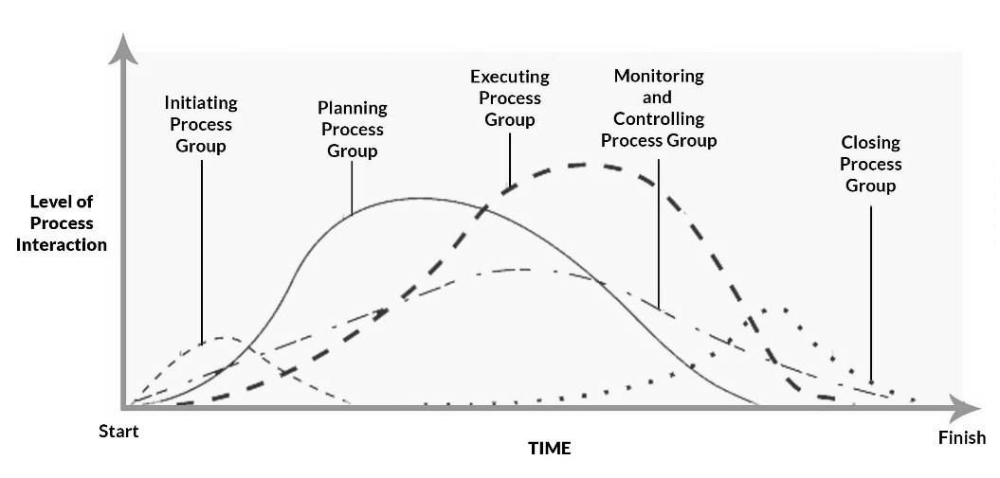

> 题源：`content/Ref/Sample Exam Questions.pdf` 的 `SAMPLE SET 6`。
>
> 参考答案与解析由 GPT-5.5 辅助生成，并结合本站课程笔记与计算复核整理；**非官方答案，仅供参考**。若与课堂讲解或官方答案冲突，以官方答案为准。

## Section A: Multiple Choice Questions

<strong>(1.1)</strong> Which item is correct about applying DFM in the initial design or production stage? <strong>[2]</strong>

<button class="quiz-option" data-option="A" type="button">AApplying DFM in an initial design stage provides higher impact with lower cost than the production stage.</button>
<button class="quiz-option" data-option="B" type="button">BInitial design provides higher impact but higher cost than production.</button>
<button class="quiz-option" data-option="C" type="button">CProduction provides higher impact with lower cost than initial design.</button>
<button class="quiz-option" data-option="D" type="button">DProduction provides higher impact but higher cost than initial design.</button>
<button class="quiz-option" data-option="E" type="button">EBoth stages provide the same impact and cost.</button>

<strong class="quiz-answer">参考答案：A</strong>

DFM 越早介入越有效，初始设计阶段变更成本最低、影响最大。

---

<strong>(1.2)</strong> Which is the exception among actionable sustainable design principles? <strong>[2]</strong>

<button class="quiz-option" data-option="A" type="button">ADematerialization.</button>
<button class="quiz-option" data-option="B" type="button">BMigration to product-service systems.</button>
<button class="quiz-option" data-option="C" type="button">CLimit or eliminate long-distance outsourcing.</button>
<button class="quiz-option" data-option="D" type="button">DDesign for a shorter period of usage.</button>
<button class="quiz-option" data-option="E" type="button">EInvest in simulation.</button>

<strong class="quiz-answer">参考答案：D</strong>

可持续设计鼓励延长寿命、减少资源消耗；缩短使用周期与其相反。

---

<strong>(1.3)</strong> Which item is not classified as an appraisal cost? <strong>[2]</strong>

<button class="quiz-option" data-option="A" type="button">ATest and inspection</button>
<button class="quiz-option" data-option="B" type="button">BSupplier acceptance sampling</button>
<button class="quiz-option" data-option="C" type="button">CProduct audits</button>
<button class="quiz-option" data-option="D" type="button">DEquipment upgrades</button>
<button class="quiz-option" data-option="E" type="button">ECalibration</button>

<strong class="quiz-answer">参考答案：D</strong>

Appraisal cost 是评价/检验质量的成本；设备升级更接近预防或改进投入，不是 appraisal。

---

<strong>(1.4)</strong> Project A has NPV of USD 1.2 million; Project B has BCR of 1.035; Project C has IRR of -0.03%. Which appears most attractive? <strong>[2]</strong>

<button class="quiz-option" data-option="A" type="button">AProject A is the most attractive.</button>
<button class="quiz-option" data-option="B" type="button">BProject B is the most attractive.</button>
<button class="quiz-option" data-option="C" type="button">CProject C is the most attractive.</button>
<button class="quiz-option" data-option="D" type="button">DAll three are equally attractive.</button>
<button class="quiz-option" data-option="E" type="button">EIt is uncertain based on the provided information.</button>

<strong class="quiz-answer">参考答案：A（需人工复核）</strong>

按题面“appears”判断，A 有明确正 NPV，B 仅略高于 1，C 为负 IRR，因此 A 最有吸引力。严格财务比较中，不同指标不能完全直接比较。

---

<strong>(1.5)</strong> SWOT is mainly used in project management for which item? <strong>[2]</strong>

<button class="quiz-option" data-option="A" type="button">ASilver Whisker Optimization Technique</button>
<button class="quiz-option" data-option="B" type="button">BA tool or technique used in identifying risks</button>
<button class="quiz-option" data-option="C" type="button">CA tool for structured ranking of causes/effects</button>
<button class="quiz-option" data-option="D" type="button">DA graphic view of relative probabilities</button>
<button class="quiz-option" data-option="E" type="button">ENone of the above</button>

<strong class="quiz-answer">参考答案：B</strong>

SWOT 可通过 strengths、weaknesses、opportunities、threats 帮助识别项目风险。

---

<strong>(1.6)</strong> An EVM report shows CPI = 1.1 and SPI = 0.9. What should we understand? <strong>[2]</strong>

<button class="quiz-option" data-option="A" type="button">ATrading controls need to be tightened.</button>
<button class="quiz-option" data-option="B" type="button">BThe project is under budget and behind schedule.</button>
<button class="quiz-option" data-option="C" type="button">CThe project is over budget.</button>
<button class="quiz-option" data-option="D" type="button">DThe project is ahead of schedule.</button>
<button class="quiz-option" data-option="E" type="button">EChoices C & D</button>

<strong class="quiz-answer">参考答案：B</strong>

CPI > 1 表示成本效率好、低于预算；SPI < 1 表示进度落后。

---

<strong>(1.7)</strong> In a Profit and Loss statement, EBITDA/EBITA is equal to: <strong>[2]</strong>

<button class="quiz-option" data-option="A" type="button">ATotal Sales minus Cost of Sales</button>
<button class="quiz-option" data-option="B" type="button">BTotal Expenses minus Net Profit</button>
<button class="quiz-option" data-option="C" type="button">CTotal Sales minus (Salaries + Rent)</button>
<button class="quiz-option" data-option="D" type="button">DGross Profit minus all company operating expenses</button>
<button class="quiz-option" data-option="E" type="button">EFull production costs minus Net Profit</button>

<strong class="quiz-answer">参考答案：D</strong>

课程简化口径下，Gross Profit 减经营费用可得到扣除利息和税等之前的收益。

---

<strong>(1.8)</strong> If a company has the structure shown below, it is called: <strong>[2]</strong>

<button class="quiz-option" data-option="A" type="button">AA Team-Based Structure</button>
<button class="quiz-option" data-option="B" type="button">BA Matrix Structure</button>
<button class="quiz-option" data-option="C" type="button">CA Divisional Structure</button>
<button class="quiz-option" data-option="D" type="button">DA Simple Startup Structure</button>
<button class="quiz-option" data-option="E" type="button">EA Military Command Structure</button>

<strong class="quiz-answer">参考答案：B</strong>

图中职能部门与产品团队/制造单元之间交叉连接，符合矩阵结构。

---

<strong>(1.9)</strong> A Sole Trader Company is: <strong>[2]</strong>

<button class="quiz-option" data-option="A" type="button">AA business you run as an individual, keeping profits after tax and personally responsible for losses.</button>
<button class="quiz-option" data-option="B" type="button">BA partnership with shared responsibility and profits.</button>
<button class="quiz-option" data-option="C" type="button">CA company whose shares can be freely traded on the stock market.</button>
<button class="quiz-option" data-option="D" type="button">DAn organisation set up to avoid tax or director responsibility.</button>
<button class="quiz-option" data-option="E" type="button">EA separate legal company with separate finances.</button>

<strong class="quiz-answer">参考答案：A</strong>

Sole trader 是个人经营、个人承担损失和责任的业务形式。

---

<strong>(1.10)</strong> Buying equipment costs 30,000 RMB plus 500 RMB/day. Leasing costs 2,000 RMB/day. Maximum lease time before buying is cheaper? <strong>[2]</strong>

<button class="quiz-option" data-option="A" type="button">A3 days</button>
<button class="quiz-option" data-option="B" type="button">B10 days</button>
<button class="quiz-option" data-option="C" type="button">C20 days</button>
<button class="quiz-option" data-option="D" type="button">D30 days</button>
<button class="quiz-option" data-option="E" type="button">E16.333 days</button>

<strong class="quiz-answer">参考答案：C</strong>

2000d = 30000 + 500d，解得 d = 20。

---

<strong>(1.11)</strong> What is a Profit & Loss statement? <strong>[2]</strong>

<button class="quiz-option" data-option="A" type="button">AIt only summarises sales revenues.</button>
<button class="quiz-option" data-option="B" type="button">BIt only summarises payments or expenses.</button>
<button class="quiz-option" data-option="C" type="button">CIt is only used when the company makes a loss.</button>
<button class="quiz-option" data-option="D" type="button">DIt summarises sales revenues, payments, and expenses for the financial year.</button>
<button class="quiz-option" data-option="E" type="button">EIt is only used when the company makes a profit.</button>

<strong class="quiz-answer">参考答案：D</strong>

P&L 表用于汇总收入、成本费用和利润。

---

<strong>(1.12)</strong> Defender strategic posture displays which characteristics? <strong>[2]</strong>

<button class="quiz-option" data-option="A" type="button">APioneering changes and aggressively exploring opportunities with flexible organic structure.</button>
<button class="quiz-option" data-option="B" type="button">BStability and efficiency, maintaining a small niche, with mechanistic and centralised structure and one cost-efficient technology.</button>
<button class="quiz-option" data-option="C" type="button">CBalanced risks and profits, cautiously exploiting proven new markets with matrix organisation.</button>
<button class="quiz-option" data-option="D" type="button">DReluctant to act, unsure focus, and unclear strategy.</button>
<button class="quiz-option" data-option="E" type="button">EStability and efficiency while aggressively exploring new markets with organic structure.</button>

<strong class="quiz-answer">参考答案：B</strong>

Defender 强调稳定、效率、明确小市场和机械式集中控制结构。

## Section B: Long Questions

### Q2 Tower Crane, Process Groups, Leadership, EVM

#### Q2(a-b) Tower Crane CPM

展示参考答案

Using the given table, the CPM results are:

| Task | ES | EF | LS | LF | Float |
| ---: | ---: | ---: | ---: | ---: | ---: |
| 0 | 0 | 0 | 0 | 0 | 0 |
| 1 | 0 | 3 | 0 | 3 | 0 |
| 2 | 3 | 7 | 3 | 7 | 0 |
| 3 | 3 | 6 | 5 | 8 | 2 |
| 4 | 7 | 8 | 7 | 8 | 0 |
| 5 | 8 | 10 | 8 | 10 | 0 |
| 6 | 10 | 14 | 11 | 15 | 1 |
| 7 | 10 | 13 | 12 | 15 | 2 |
| 8 | 10 | 15 | 10 | 15 | 0 |
| 9 | 15 | 16 | 15 | 16 | 0 |
| 10 | 16 | 20 | 17 | 21 | 1 |
| 11 | 16 | 21 | 16 | 21 | 0 |
| 12 | 21 | 23 | 21 | 23 | 0 |
| 13 | 23 | 24 | 23 | 24 | 0 |
| 14 | 21 | 23 | 22 | 24 | 1 |
| 15 | 24 | 25 | 24 | 25 | 0 |
| 16 | 25 | 26 | 25 | 26 | 0 |
| 17 | 26 | 27 | 26 | 27 | 0 |
| 18 | 27 | 28 | 27 | 28 | 0 |
| 19 | 28 | 28 | 28 | 28 | 0 |

Critical path:

$$
0 \rightarrow 1 \rightarrow 2 \rightarrow 4 \rightarrow 5 \rightarrow 8 \rightarrow 9 \rightarrow 11 \rightarrow 12 \rightarrow 13 \rightarrow 15 \rightarrow 16 \rightarrow 17 \rightarrow 18 \rightarrow 19
$$

Project duration is **28 days**.

If Task 8 cannot start until Task 7 is completed, duration becomes **31 days** and the new critical path includes Task 7:

$$
0 \rightarrow 1 \rightarrow 2 \rightarrow 4 \rightarrow 5 \rightarrow 7 \rightarrow 8 \rightarrow 9 \rightarrow 11 \rightarrow 12 \rightarrow 13 \rightarrow 15 \rightarrow 16 \rightarrow 17 \rightarrow 18 \rightarrow 19
$$

#### Q2(c) PMI Process Groups

展示参考答案

| Scenario | Process group |
| --- | --- |
| Managing changes, recommending actions, overseeing work against plan, ensuring approved modifications | Monitoring and Controlling |
| Outlining strategies and tactics, identifying risks, documenting execution processes | Planning |
| Clarifying project purpose and scope to stakeholders | Initiating |
| Ensuring tasks are completed, obtaining approval to conclude a phase, updating documents | Closing |

#### Q2(d) Leadership vs Management

展示参考答案

| Leadership | Management |
| --- | --- |
| Focuses on vision, direction, and motivation | Focuses on planning, organizing, and controlling work |
| Inspires people and handles change | Coordinates resources and maintains stability |
| Influences commitment and culture | Monitors performance, schedule, cost, and procedures |

Both are needed: leadership helps the team want to achieve the goal; management ensures the work is structured and delivered.

#### Q2(e) Earned Value Management

PV = USD 10,000, EV = USD 8,500, AC = USD 8,000. Calculate SPI, CPI, and interpret performance. **[3]**

展示参考答案

$$
SPI=\frac{EV}{PV}=\frac{8,500}{10,000}=0.85
$$

$$
CPI=\frac{EV}{AC}=\frac{8,500}{8,000}=1.0625
$$

`SPI < 1` means the project is behind schedule. `CPI > 1` means the project is under budget / cost efficient. Therefore, it is behind schedule but performing well on cost.

### Q3 DFM, Capability, Project Management

#### Q3(t) DFM and Process Capability

展示参考答案

**Poka-yoke:** Poka-yoke is mistake-proofing. In Six Sigma, it reduces defects by preventing errors or making errors immediately visible. Example: in an LED laboratory setup, use keyed connectors so LED polarity cannot be reversed, or use a fixture that lights a warning LED if the circuit is connected incorrectly.

**Resistor process capability:** Target resistance is 12 ohms with tolerance ±2, so `USL = 14`, `LSL = 10`. Mean is `12.2`, standard deviation is `0.5`.

$$
C_p=\frac{USL-LSL}{6\sigma}=\frac{4}{3}=1.33
$$

$$
C_{pk}=\min\left(\frac{14-12.2}{1.5},\frac{12.2-10}{1.5}\right)=\min(1.20,1.47)=1.20
$$

The process is reasonably capable, but the mean is slightly high, so the upper specification side limits Cpk.

**4Rs:** Any two of Reduce, Reuse, Recycle, Repair.

#### Q3(u) Project Management Short Questions

展示参考答案

**Talent Triangle:** Any two of technical project management, leadership, and strategic/business management. Technical PM covers tools such as WBS, schedule and risk management; leadership covers motivation, communication and conflict; strategic/business management links the project to business goals.

**Detailed hierarchical decomposition:** Work Breakdown Structure (WBS), or Create WBS.

**Three-point estimating:** Optimistic `O = 9`, Most likely `M = 12`, Pessimistic `P = 16`.

Triangular expected duration:

$$
E_T=\frac{9+12+16}{3}=12.33\ \text{weeks}
$$

Triangular standard deviation:

$$
\sigma_T=\sqrt{\frac{9^2+12^2+16^2-9(12)-9(16)-12(16)}{18}}\approx1.43\ \text{weeks}
$$

Beta/PERT expected duration:

$$
E_B=\frac{9+4(12)+16}{6}=12.17\ \text{weeks}
$$

Beta/PERT standard deviation:

$$
\sigma_B=\frac{16-9}{6}=1.17\ \text{weeks}
$$

**Communication channels:** Initial team has 6 members:

$$
\frac{6(6-1)}{2}=15
$$

After three join and two leave, team size is 7:

$$
\frac{7(7-1)}{2}=21
$$

New communication channels added: `21 - 15 = 6`.

**Conflict methods:** Collaborate/Problem Solve is win-win. Compromise/Reconcile is partial lose-lose because both sides give up something. Withdraw/Avoid leaves the issue unresolved, so neither side gains a substantive outcome.

### Q4 Transceiver Break-even and Make-or-Buy

XYZ requires `17,500` optical transceivers annually. Supplier price is `57 RMB` each. Fixed overhead is `568,750 RMB`; facilities are currently rented for `225,000 RMB` per year. Internal variable costs are Direct Materials `22.50`, Direct Labour `12.50`, Variable Overhead `2.50` RMB per transceiver. Selling price is `78.125 RMB`.

展示参考答案

**(a) Break-even relationship**

$$
SP\times Q=FC+VC\times Q
$$

$$
Q_{BE}=\frac{FC}{SP-VC}
$$

**(b) Buying scenarios**

External purchase cost:

$$
17,500\times57=997,500\ \text{RMB}
$$

| Scenario | Purchase cost | Fixed overhead | Rental income | Equivalent annual cost |
| --- | ---: | ---: | ---: | ---: |
| Facilities rented | 997,500 | 568,750 | -225,000 | 1,341,250 |
| Rental expired | 997,500 | 568,750 | 0 | 1,566,250 |

**(c) Internal manufacturing**

Variable cost per transceiver:

$$
22.5+12.5+2.5=37.5\ \text{RMB}
$$

Annual internal cost:

$$
17,500\times37.5+568,750=1,225,000\ \text{RMB}
$$

Internal manufacturing is cheaper than buying, so XYZ should make the transceivers internally.

**(d) Cost/revenue table**

$$
TC=568,750+37.5Q,\quad REV=78.125Q
$$

| Quantity | Total Cost | Revenue | Profit |
| ---: | ---: | ---: | ---: |
| 3,500 | 700,000.0 | 273,437.5 | -426,562.5 |
| 7,000 | 831,250.0 | 546,875.0 | -284,375.0 |
| 10,500 | 962,500.0 | 820,312.5 | -142,187.5 |
| 14,000 | 1,093,750.0 | 1,093,750.0 | 0.0 |
| 17,500 | 1,225,000.0 | 1,367,187.5 | 142,187.5 |

**(e) Profit and safety margin**

At full capacity:

$$
Profit=1,367,187.5-1,225,000=142,187.5\ \text{RMB}
$$

Break-even quantity:

$$
Q_{BE}=\frac{568,750}{78.125-37.5}=14,000
$$

Safety margin is `17,500 - 14,000 = 3,500` transceivers, or **20%**.

**(f) Graph**

Plot `FC = 568,750`, `VC = 37.5Q`, `TC = 568,750 + 37.5Q`, and `REV = 78.125Q`. Mark break-even at **14,000 transceivers** and **1,093,750 RMB**.

